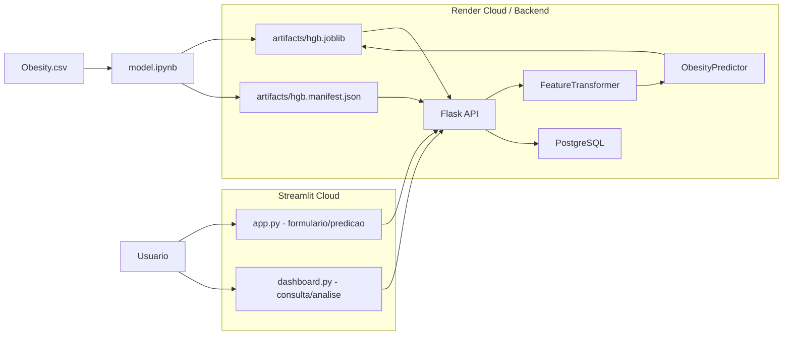
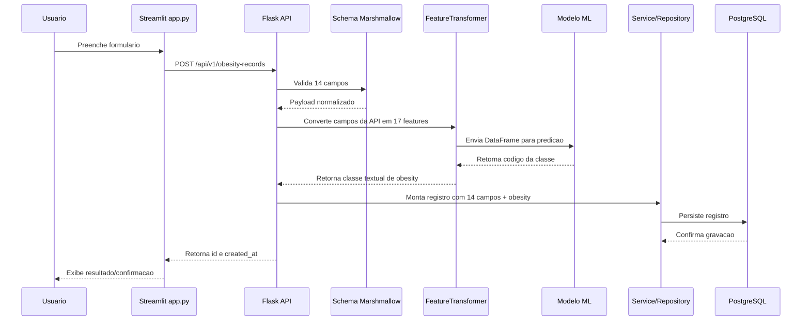

# README-Fluxo: arquitetura backend, modelo ML e consumo pelo Streamlit

## 1. Objetivo do documento

Este documento descreve, em linguagem academica, o fluxo de construcao e uso da solucao de Machine Learning aplicada a predicao de obesidade. A descricao foi elaborada a partir do diagrama `Diagrama backend ML streamlit.drawio.png` e da implementacao existente no projeto `backend`.

O objetivo e demonstrar como o modelo treinado no notebook e incorporado ao backend, como a API organiza suas rotas e responsabilidades, e como uma interface externa em Streamlit pode consumir esses recursos para cadastrar dados, obter predicoes e consultar registros.

## 2. Visao geral da arquitetura

O fluxo representado no diagrama pode ser interpretado em tres blocos principais:

1. Camada de ciencia de dados: usa `Obesity.csv` no notebook para treinar o modelo e gerar o artefato serializado.
2. Camada backend: hospeda a API Flask, carrega o modelo, valida as entradas, executa a predicao e persiste os registros no banco.
3. Camada de apresentacao: usa Streamlit Cloud para interacao do usuario com telas de formulario e dashboard.



No diagrama original, o artefato do modelo aparece como `modelo.job`. Na implementacao atual do backend, esse papel e desempenhado por `artifacts/hgb.joblib`.

## 3. Origem do modelo de Machine Learning

A etapa de modelagem ocorre fora do backend, no notebook `model.ipynb`. Esse notebook usa a base `Obesity.csv` para preparar os dados, transformar variaveis categoricas e treinar um classificador de obesidade.

O modelo gerado e disponibilizado ao backend por meio de dois arquivos:

| Arquivo | Funcao |
| --- | --- |
| `artifacts/hgb.joblib` | Modelo serializado com `joblib`; contem o classificador `HistGradientBoostingClassifier`. |
| `artifacts/hgb.manifest.json` | Manifesto de verificacao do modelo; registra algoritmo, versao, tamanho, hash SHA-256, features esperadas e classes de saida. |

O manifesto e essencial para garantir reprodutibilidade e controle de integridade. Ao iniciar, a API verifica se o arquivo `.joblib` corresponde ao hash e tamanho definidos no manifesto. Se houver divergencia, a aplicacao falha em vez de utilizar um modelo inconsistente.

## 4. Modelo utilizado no backend

O manifesto atual identifica o modelo como:

```text
Nome: hgb
Versao: 1.0.0
Algoritmo: HistGradientBoostingClassifier
Scikit-learn: 1.7.2
Quantidade de features esperadas: 17
Quantidade de classes: 7
```

Classes retornadas pelo modelo:

| Codigo | Classe |
| --- | --- |
| 0 | `Insufficient_Weight` |
| 1 | `Normal_Weight` |
| 2 | `Obesity_Type_I` |
| 3 | `Obesity_Type_II` |
| 4 | `Obesity_Type_III` |
| 5 | `Overweight_Level_I` |
| 6 | `Overweight_Level_II` |

O backend nao recebe o campo `obesity` do usuario. Esse valor e sempre calculado no servidor pelo modelo de Machine Learning.

## 5. Inicializacao do backend

A aplicacao Flask e criada em `app/__init__.py` pela funcao `create_app`.

Durante a inicializacao, o backend:

1. Carrega as configuracoes de ambiente, como `APP_ENV` e `DATABASE_URL`.
2. Inicializa extensoes Flask, SQLAlchemy e Flask-Smorest.
3. Registra as rotas de saude, dominios e registros de obesidade.
4. Registra middlewares de log e `X-Request-ID`.
5. Registra tratadores globais de erro em formato `application/problem+json`.
6. Carrega e valida o artefato de Machine Learning.
7. Armazena o preditor em `app.config["ML_PREDICTOR"]`.

O arquivo `wsgi.py` expoe a aplicacao para execucao com Gunicorn:

```python
from app import create_app

app = create_app()
```

No Dockerfile, a API e executada com:

```text
gunicorn --bind=0.0.0.0:8000 --workers=2 --timeout=30 --graceful-timeout=30 wsgi:app
```

## 6. Fluxo de predicao e persistencia

O fluxo principal ocorre quando o cliente envia um formulario para `POST /api/v1/obesity-records`.



Na pratica, a responsabilidade do backend e impedir que o cliente defina manualmente a classe de obesidade. O usuario envia apenas os atributos de entrada e o sistema calcula a classificacao de forma centralizada.

## 7. Contrato de entrada do cadastro

A rota `POST /api/v1/obesity-records` aceita exatamente 14 campos. O schema `ObesityRecordCreateSchema` rejeita campos desconhecidos; portanto, se o cliente enviar `obesity`, a API retorna erro de validacao.

Campos recebidos:

| Campo da API | Tipo | Responsabilidade |
| --- | --- | --- |
| `idade` | inteiro | Representa a idade do individuo. |
| `sexo_biologico` | inteiro | Codifica o sexo biologico usado na transformacao de features. |
| `come_vegetaiis` | inteiro | Frequencia de consumo de vegetais. |
| `refeicoes_diariamente` | inteiro | Quantidade/frequencia de refeicoes diarias. |
| `come_entre_refeicao` | texto | Frequencia de consumo entre refeicoes. |
| `litro_agua` | inteiro | Consumo diario de agua em categorias. |
| `frequencia_semanal_atvidade_fisica` | inteiro | Frequencia semanal de atividade fisica. |
| `horas_dispositivo_eletronico` | inteiro | Tempo de uso de dispositivos eletronicos. |
| `consome_bebida_alcoolica` | texto | Frequencia de consumo de alcool. |
| `historico_familiar` | texto | Indica historico familiar relacionado a obesidade. |
| `alimentos_calorico` | texto | Indica consumo frequente de alimentos caloricos. |
| `monitora_calorias` | texto | Indica monitoramento de calorias. |
| `fuma` | texto | Indica habito de fumar. |
| `meio_transporte` | texto | Informa o meio de transporte principal. |

Exemplo de payload:

```json
{
  "idade": 25,
  "sexo_biologico": 1,
  "come_vegetaiis": 2,
  "refeicoes_diariamente": 3,
  "come_entre_refeicao": "somentimes",
  "litro_agua": 2,
  "frequencia_semanal_atvidade_fisica": 1,
  "horas_dispositivo_eletronico": 1,
  "consome_bebida_alcoolica": "no",
  "historico_familiar": "yes",
  "alimentos_calorico": "no",
  "monitora_calorias": "no",
  "fuma": "no",
  "meio_transporte": "public_transportation"
}
```

## 8. Transformacao dos dados para o modelo

O backend nao envia diretamente o payload bruto para o modelo. Antes da inferencia, o modulo `app/ml/feature_transformer.py` converte os 14 campos da API em um `DataFrame` com 17 features, na mesma ordem esperada pelo `hgb.joblib`.

| Feature do modelo | Origem no payload | Transformacao |
| --- | --- | --- |
| `Age` | `idade` | Conversao direta. |
| `FCVC` | `come_vegetaiis` | Conversao direta. |
| `NCP` | `refeicoes_diariamente` | Conversao direta. |
| `CAEC` | `come_entre_refeicao` | Mapeamento ordinal: `no=0`, `somentimes=1`, `frequently=2`, `always=3`. |
| `CH2O` | `litro_agua` | Conversao direta. |
| `FAF` | `frequencia_semanal_atvidade_fisica` | Conversao direta. |
| `TUE` | `horas_dispositivo_eletronico` | Conversao direta. |
| `CALC` | `consome_bebida_alcoolica` | Mapeamento ordinal. |
| `Gender_Male` | `sexo_biologico` | `1` para masculino, `0` para feminino. |
| `family_history_yes` | `historico_familiar` | `1` quando `yes`, senao `0`. |
| `FAVC_yes` | `alimentos_calorico` | `1` quando `yes`, senao `0`. |
| `SCC_yes` | `monitora_calorias` | `1` quando `yes`, senao `0`. |
| `SMOKE_yes` | `fuma` | `1` quando `yes`, senao `0`. |
| `MTRANS_Bike` | `meio_transporte` | One-hot para `bike`. |
| `MTRANS_Motorbike` | `meio_transporte` | One-hot para `motorbike`. |
| `MTRANS_Public_Transportation` | `meio_transporte` | One-hot para `public_transportation`. |
| `MTRANS_Walking` | `meio_transporte` | One-hot para `walking`. |

O valor `automobile` funciona como categoria de referencia para transporte, ficando com todas as colunas `MTRANS_*` iguais a zero.

## 9. Responsabilidades das camadas

| Camada/Modulo | Responsabilidade principal |
| --- | --- |
| `model.ipynb` | Treinar e avaliar o modelo de Machine Learning a partir de `Obesity.csv`. |
| `artifacts/hgb.joblib` | Armazenar o classificador treinado usado em inferencia. |
| `artifacts/hgb.manifest.json` | Registrar metadados e integridade do modelo. |
| `app/__init__.py` | Criar a aplicacao Flask, registrar rotas e carregar o preditor ML. |
| `app/api/*_routes.py` | Expor os endpoints HTTP do backend. |
| `app/schemas/*` | Validar requests e serializar responses. |
| `app/ml/model_loader.py` | Verificar SHA-256/tamanho do artefato e carregar o modelo. |
| `app/ml/feature_transformer.py` | Converter campos da API para as 17 features esperadas pelo modelo. |
| `app/ml/predictor.py` | Executar `model.predict` e converter codigo numerico em classe textual. |
| `app/services/obesity_record_service.py` | Coordenar caso de uso: predizer, montar registro, persistir e controlar transacao. |
| `app/repositories/obesity_record_repository.py` | Isolar operacoes de banco de dados para registros de obesidade. |
| `app/models/obesity_record.py` | Definir tabela, tipos e restricoes SQL do registro persistido. |
| `migrations/` | Versionar a estrutura do banco de dados. |
| `seeds/domain_options.py` | Popular dominios usados por formularios e validacoes. |
| `Dockerfile` | Empacotar a API para execucao em ambiente conteinerizado. |
| `compose.yaml` | Orquestrar API, migracao e PostgreSQL em ambiente local. |

## 10. Rotas e responsabilidades

| Metodo | Rota | Responsabilidade |
| --- | --- | --- |
| `GET` | `/health/live` | Verificar se o processo da API esta ativo. |
| `GET` | `/health/ready` | Verificar se a API esta pronta para operar, incluindo acesso ao banco. |
| `GET` | `/api/v1/domains` | Listar dominios ativos para montar formularios no cliente. |
| `GET` | `/api/v1/domains/{field_name}` | Consultar os valores aceitos para um campo especifico. |
| `POST` | `/api/v1/obesity-records` | Receber 14 campos, predizer `obesity`, persistir o registro e retornar identificadores. |
| `GET` | `/api/v1/obesity-records` | Listar registros cadastrados, incluindo a classe `obesity` predita. |
| `GET` | `/api/v1/obesity-records/{record_id}` | Consultar um registro especifico por UUID. |
| `GET` | `/api/openapi.json` | Expor o contrato OpenAPI gerado pela aplicacao. |
| `GET` | `/api/docs` | Disponibilizar a documentacao Swagger UI. |

## 11. Persistencia dos dados

Cada registro persistido contem:

- os 14 campos informados pelo usuario;
- o campo `obesity`, calculado pelo modelo;
- `id`, gerado como UUID;
- `created_at`, gerado pelo banco.

O modelo SQL `ObesityRecord` define restricoes para manter a consistencia dos dados. Isso complementa a validacao da camada de schema e reduz o risco de gravacao de valores fora dos dominios esperados.

No diagrama, o banco aparece dentro da area do Render Cloud. Na implementacao, o backend usa PostgreSQL e recebe a conexao por `DATABASE_URL`.

## 12. Papel do Streamlit no fluxo

O diagrama indica duas telas principais em Streamlit Cloud:

| Arquivo no diagrama | Papel no fluxo |
| --- | --- |
| `app.py` | Interface de formulario. Envia os 14 campos para a API e apresenta ao usuario o resultado da predicao/cadastro. |
| `dashboard.py` | Interface analitica. Consulta registros e dominios pela API para apresentar dados consolidados ao usuario. |

Assim, o Streamlit nao executa o modelo diretamente. Ele atua como cliente da API. Essa separacao e relevante porque centraliza a regra de inferencia no backend, evitando divergencia entre multiplas interfaces.

## 13. Integridade, rastreabilidade e observabilidade

A solucao possui mecanismos importantes para um trabalho academico e para uma evolucao futura:

- Verificacao de integridade do modelo por SHA-256 e tamanho do arquivo.
- Manifesto com features e classes esperadas pelo modelo.
- Logs estruturados em JSON.
- Propagacao de `X-Request-ID` em todas as respostas.
- Erros padronizados em `application/problem+json`.
- Contrato OpenAPI validado por teste automatizado.
- Separacao entre rotas, schemas, servicos, repositorios e camada de ML.

Essas decisoes aumentam reprodutibilidade, manutencao e capacidade de auditoria.

## 14. Qualidade e testes

O projeto possui testes unitarios, de contrato e de integracao. O `pyproject.toml` configura cobertura minima de 90% e ferramentas de qualidade:

```text
pytest
pytest-cov
ruff
mypy
```

O teste de contrato OpenAPI confirma que as rotas publicadas sao:

```text
/health/live
/health/ready
/api/v1/domains
/api/v1/domains/{field_name}
/api/v1/obesity-records
/api/v1/obesity-records/{record_id}
```

Tambem confirma que o schema de criacao possui 14 campos obrigatorios e nao exige `obesity` no payload de entrada.

## 15. Limitacoes observadas

Alguns pontos merecem registro para transparencia academica:

1. O backend atual recebe 14 campos de entrada e transforma esses campos em 17 features. Ele nao recebe `Height` e `Weight` no contrato atual.
2. O artefato `hgb.joblib` contem apenas o classificador treinado. A transformacao de features foi reimplementada no backend em `FeatureTransformer`.
3. Como a pipeline completa de treino nao foi persistida junto ao modelo, e necessario manter rigorosamente a equivalencia entre o notebook e o backend.
4. O termo `somentimes` aparece como valor aceito no contrato atual, refletindo a implementacao do backend.
5. A exposicao publica exige cuidados adicionais, como autenticacao, autorizacao, politicas de privacidade, consentimento, retencao de dados e seguranca de transporte.

## 16. Conclusao academica

A arquitetura implementada demonstra a passagem de um experimento de Machine Learning para uma solucao operacionalizada em backend. O notebook e responsavel pela etapa experimental e pela geracao do modelo; o backend transforma esse artefato em um servico acessivel por HTTP; o banco armazena os registros enriquecidos com a predicao; e o Streamlit atua como camada de interacao com o usuario.

Essa divisao de responsabilidades favorece manutencao, reprodutibilidade e evolucao incremental. O backend centraliza a inferencia, padroniza validacoes e registra os resultados, enquanto a interface de apresentacao permanece desacoplada da logica de Machine Learning.

Para evolucao futura, recomenda-se persistir uma pipeline completa de preprocessamento e modelo, revisar a inclusao de `Height` e `Weight` no contrato de entrada e reforcar controles de seguranca antes de uma exposicao publica ampla.
