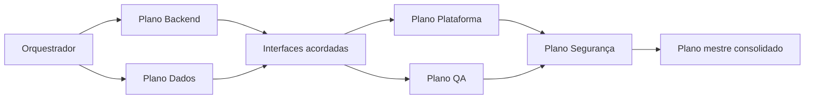

# Agentes para planejamento da implementação

| Ordem | Arquivo | Plano produzido |
|---|---|---|
| 0 | `00-orquestrador-planejamento.md` | Plano mestre e dependências |
| 1 | `01-planejador-backend-flask.md` | Fundação, schemas, services e API |
| 2 | `02-planejador-dados-postgresql.md` | Models, migrations, seed e repositories |
| 3 | `03-planejador-plataforma-observabilidade.md` | Docker, configuração, CI e operação |
| 4 | `04-planejador-qa-testes.md` | Estratégia e matriz automatizada de testes |
| 5 | `05-planejador-seguranca.md` | Controles, ameaças e gate de segurança |

## Sequência

Backend e Dados podem planejar em paralelo após o orquestrador definir as interfaces.

QA pode preparar a rastreabilidade em paralelo, mas depende dos contratos de Backend e Dados.

Segurança revisa todos os planos antes da consolidação final.

## Uso recomendado

1. Execute o Orquestrador para criar o mapa inicial.
2. Execute Backend e Dados com o mapa aprovado.
3. Execute Plataforma e QA usando os handoffs anteriores.
4. Execute Segurança como gate.
5. Devolva todos os planos ao Orquestrador.
6. O Orquestrador produz `plano-implementacao.md`.

Cada agente deve entregar um plano, não código.
