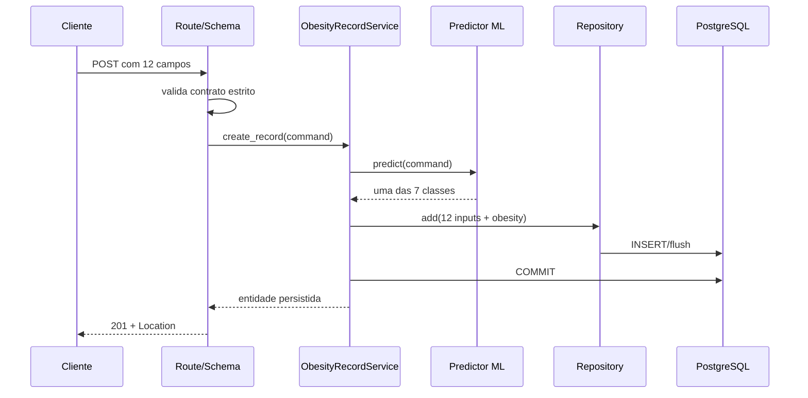

# Plano de implementação — inferência de obesidade com `hgb.joblib`

## 1. Identificação

- Orquestrador: Agente 00 — Orquestrador de planejamento.
- Agentes consultados: 01 — Backend Flask, 02 — Dados PostgreSQL, 03 — Plataforma e Observabilidade, 04 — QA e Testes, 05 — Segurança.
- Data: 2026-07-04.
- Fontes: `specs-sdd.md`, `refinamento-tecnico.md`, `refinamento-machine-learning-core.md`, código atual do backend, `model.ipynb`, `Obesity.csv` e `hgb.joblib`.
- Atividades existentes afetadas: AT-02, AT-09, AT-11, AT-13, AT-16 a AT-20, AT-22 a AT-30.
- Novas atividades: AT-ML-01 a AT-ML-12.
- Novos cenários: CT-ML-01 a CT-ML-12, CT-OBS-ML-01, CT-SEC-ML-01 e CT-PERF-ML-01.
- Natureza deste documento: planejamento; nenhuma implementação de aplicação é feita nesta etapa.

## 2. Objetivo

Alterar o caso de uso `POST /api/v1/obesity-records` para receber somente os 12 dados informados pelo cliente, transformá-los nas 15 features esperadas pelo modelo `hgb.joblib`, predizer uma das sete classificações de obesidade, persistir os 12 inputs junto com o campo `obesity` calculado e permitir sua consulta por `GET /api/v1/obesity-records/{record_id}`.

O resultado observável será:

1. o cliente não informa `obesity` no POST;
2. a API valida os 12 campos de entrada;
3. a camada de serviço executa a inferência;
4. somente uma classificação válida é persistida;
5. POST mantém `201`, UUID, `created_at` e `Location`;
6. GET retorna `id`, `created_at`, os 12 inputs e o `obesity` predito;
7. uma falha de inferência não gera registro parcial nem expõe dados de saúde.

## 3. Diagnóstico do estado atual

### 3.1 Backend

- O POST atual exige 13 campos, incluindo `obesity` fornecido pelo cliente.
- `ObesityRecordService.create_record()` apenas persiste o comando e controla commit/rollback.
- A tabela `obesity_record` já possui `obesity VARCHAR(32) NOT NULL` e `ck_record_obesity` com as sete classes.
- O repository já recebe um mapping, executa `flush()` e não faz commit; essa divisão de responsabilidade será preservada.
- O GET já serializa todos os 13 campos persistidos.
- O OpenAPI e os testes atuais ainda descrevem `obesity` como input obrigatório.
- O runtime está fixado em Python 3.10 e não declara dependências de ML.

### 3.2 Modelo e notebook

| Item | Valor verificado |
|---|---|
| Artefato | `hgb.joblib` |
| Tamanho | 2.496.160 bytes |
| SHA-256 | `045d8a5a494f05e919180ca1f972d1beafc54640c0eaec4be90407a9cd0b8ad2` |
| Tipo | `HistGradientBoostingClassifier` |
| scikit-learn de serialização | 1.8.0 |
| Features | 15, com nomes e ordem fixos |
| Classes do modelo | inteiros de 0 a 6 |
| Pipeline incluído | não; encoders e mapa textual ficaram fora do artefato |
| Runtime registrado no notebook | Python 3.13.12 |

Carregar o arquivo com scikit-learn 1.7.2 gerou `InconsistentVersionWarning`. O ambiente exato de treinamento ainda não possui lock reproduzível; isso é bloqueio de DoR, não detalhe a ser resolvido silenciosamente durante a implementação.

### 3.3 Conflito de contrato

O SDD atual, especialmente DD-16, define `obesity` como entrada e exclui inferência. O refinamento de ML é a decisão explícita mais recente e, conforme as regras dos agentes, tem precedência. O SDD, o refinamento técnico, o OpenAPI e os CT antigos devem ser atualizados antes da implementação.

## 4. Escopo

### Incluído

- contrato 12 entradas → 13 campos persistidos;
- transformação determinística das entradas nas 15 features;
- carregamento e verificação do `hgb.joblib`;
- inferência e mapeamento do código para a classe textual;
- integração transacional com o service/repository existente;
- atualização de schemas, rota, OpenAPI, catálogo, documentação e configuração;
- empacotamento imutável do artefato na imagem;
- testes unitários, integração PostgreSQL, contrato, E2E, segurança e desempenho;
- observabilidade técnica sem payload, features, classe ou probabilidades nos logs;
- estratégia de promoção e rollback por imagem e hash do modelo.

### Excluído

- retreinamento ou troca do algoritmo;
- mudança dos 12 domínios de entrada da API v1;
- retorno de probabilidade/confiança ao cliente;
- criação de endpoint de inferência separado;
- alteração, exclusão ou listagem geral de registros;
- upload ou troca dinâmica de modelos;
- administração de modelos pela API;
- autenticação, autorização, consentimento, retenção, TLS e publicação externa;
- inclusão de `model_version` no banco nesta entrega; se exigida para auditoria, deverá ser proposta em decisão e migration separadas.

## 5. Premissas e decisões propostas

As decisões ML-DD-01 a ML-DD-05 exigem aprovação para liberar a implementação.

| ID | Premissa/decisão | Estado e evidência |
|---|---|---|
| ML-DD-01 | POST exige exatamente 12 inputs; `obesity` enviado pelo cliente retorna 422/`unknown_field`. | Proposta baseada no refinamento ML mais recente. |
| ML-DD-02 | POST preserva a resposta atual (`id`, `created_at`, `Location`); a classificação é consultada no GET. | Minimiza quebra e atende ao refinamento. |
| ML-DD-03 | GET continua retornando os 13 campos; `obesity` é read-only. | Requisito explícito do refinamento. |
| ML-DD-04 | `GET /domains` mantém os 12 catálogos para compatibilidade; `obesity` permanece como vocabulário de saída, com `required=false`. | Preserva nomes e domínios v1 sem tratá-lo como input. |
| ML-DD-05 | O artefato aprovado é identificado pelo SHA-256 deste plano; qualquer mudança exige novo manifesto e golden tests. | Integridade e rollback. |
| ML-DD-06 | A transformação será implementada em módulo próprio porque o joblib contém apenas o classificador. | Confirmado no notebook/artefato. |
| ML-DD-07 | O runtime deve usar versões compatíveis e reproduzíveis com scikit-learn 1.8.0; o lock do ambiente é gate. | O load em 1.7.2 emitiu incompatibilidade. |
| ML-DD-08 | O modelo será carregado e validado uma vez por worker, nunca por request. | Latência, memória e segurança. |
| ML-DD-09 | Inferência ocorre antes de `repository.add()`; somente saída válida entra na transação de persistência. | Evita registro parcial e conexão ocupada durante CPU. |
| ML-DD-10 | Falha de artefato no bootstrap impede readiness/startup; falha inesperada em runtime retorna 500 sanitizado e zero insert. | Fail closed. |
| ML-DD-11 | Não registrar payload, features, classe predita nem probabilidades. | DD-13 e natureza de saúde dos dados. |
| ML-DD-12 | O modelo, manifesto e aplicação são promovidos e revertidos como uma única imagem imutável. | Evita incompatibilidade entre código e artefato. |

## 6. Contratos afetados

### 6.1 HTTP

#### POST `/api/v1/obesity-records`

- Request: os 12 campos atuais, exceto `obesity`.
- `obesity` presente no JSON: 422 `application/problem+json`, campo `obesity`, código `unknown_field`.
- Sucesso: 201, `Location`, `X-Request-ID`, corpo com `id` e `created_at`.
- Falha técnica de inferência: 500 genérico, sem detalhe do joblib, versão, stack, input ou predição.

#### GET `/api/v1/obesity-records/{record_id}`

- Mantém os status 200, 400 e 404.
- Resposta 200 contém 12 inputs, `obesity`, `id` e `created_at`.
- GET nunca recalcula o modelo; devolve o resultado persistido.

#### GET `/api/v1/domains`

- Continua retornando 12 catálogos.
- O item `obesity` contém as sete classes, mas `required=false` e documentação de campo derivado/read-only.
- Os 11 domínios de entrada permanecem `required=true`.

### 6.2 Interfaces internas

```python
class FeatureTransformer(Protocol):
    def transform(self, command: Mapping[str, object]) -> pandas.DataFrame: ...

class ObesityPredictor(Protocol):
    def predict(self, command: Mapping[str, object]) -> str: ...

class ObesityRecordService:
    def create_record(self, command: Mapping[str, object]) -> ObesityRecord: ...
```

O service recebe predictor, repository e transação por injeção. O predictor não conhece HTTP, sessão SQL ou model SQLAlchemy. O transformer não carrega o artefato.

### 6.3 Contrato do manifesto

`artifacts/hgb.manifest.json` deve conter, no mínimo:

- nome e versão lógica do modelo;
- SHA-256 e tamanho do arquivo;
- algoritmo e versão do scikit-learn;
- versões do runtime e dependências recuperadas do ambiente de exportação;
- nomes e ordem das 15 features;
- códigos 0 a 6 e classes textuais;
- commit/proveniência do notebook e dataset;
- golden vectors aprovados ou referência para a fixture correspondente.

## 7. Transformação exata de features

| Ordem | Feature do modelo | Origem/regra na API |
|---:|---|---|
| 1 | `Age` | `idade` |
| 2 | `FCVC` | `come_vegetaiis` |
| 3 | `NCP` | `refeicoes_diariamente` |
| 4 | `CAEC` | `come_entre_refeicao`: no=0, somentimes=1, frequently=2, always=3 |
| 5 | `CH2O` | `litro_agua` |
| 6 | `FAF` | `frequencia_semanal_atvidade_fisica` |
| 7 | `TUE` | `horas_dispositivo_eletronico` |
| 8 | `CALC` | `consome_bebida_alcoolica`: no=0, somentimes=1, frequently=2, always=3 |
| 9 | `Gender_Male` | 1 quando `sexo_biologico=1`; 0 quando 2 |
| 10 | `family_history_yes` | 1 para yes; 0 para no |
| 11 | `FAVC_yes` | 1 para `alimentos_calorico=yes`; 0 para no |
| 12 | `MTRANS_Bike` | 1 somente para `bike` |
| 13 | `MTRANS_Motorbike` | 1 somente para `motorbike` |
| 14 | `MTRANS_Public_Transportation` | 1 somente para `public_transportation` |
| 15 | `MTRANS_Walking` | 1 somente para `walking` |

`automobile` é a categoria de referência e produz zero nas quatro features `MTRANS_*`. O transformer deve criar uma linha de DataFrame com esses nomes e exatamente nessa ordem. O literal público `somentimes` será preservado e traduzido apenas internamente para o ordinal 1.

### Mapeamento de saída

| Código | `obesity` persistido |
|---:|---|
| 0 | `Insufficient_Weight` |
| 1 | `Normal_Weight` |
| 2 | `Obesity_Type_I` |
| 3 | `Obesity_Type_II` |
| 4 | `Obesity_Type_III` |
| 5 | `Overweight_Level_I` |
| 6 | `Overweight_Level_II` |

Saída vazia, múltipla, NaN, não inteira ou fora de 0 a 6 deve falhar fechada antes do repository.

## 8. Fluxo planejado



Qualquer exceção entre predictor, flush e commit executa rollback. A inferência não pode ser refeita no GET nem após o commit.

## 9. Inventário de arquivos e propriedade

| Arquivo/diretório | Ação | Responsável | Motivo |
|---|---|---|---|
| `spec-to-development/specs-sdd.md` | Alterar | Backend/Orquestrador | Substituir DD-16 e documentar arquitetura ML. |
| `spec-to-development/refinamento-tecnico.md` | Alterar | Backend/Orquestrador | Atualizar contrato, AT e CT. |
| `app/domain_catalog.py` | Alterar | Backend/ML | Separar `INPUT_FIELDS`, `RECORD_FIELDS` e `OBESITY_CLASSES`. |
| `app/schemas/obesity_record_schema.py` | Alterar | Backend/ML | Create com 12 inputs e Read com 13 campos. |
| `app/api/obesity_record_routes.py` | Alterar | Backend/ML | Injetar service com predictor e atualizar OpenAPI. |
| `app/services/obesity_record_service.py` | Alterar | Backend/ML | Predizer, validar, compor 13 campos e controlar transação. |
| `app/__init__.py`, `app/config.py`, `app/extensions.py` | Alterar | Backend/ML | Bootstrap, configuração e carregamento único. |
| `app/ml/__init__.py` | Criar | Backend/ML | Pacote de inferência. |
| `app/ml/feature_transformer.py` | Criar | Backend/ML | Transformação 12 → 15. |
| `app/ml/model_loader.py` | Criar | Backend/ML | Hash, manifesto, load e validação fail-fast. |
| `app/ml/predictor.py` | Criar | Backend/ML | Predição e mapa 0 → 6. |
| `artifacts/hgb.joblib` | Criar por cópia aprovada | Backend/ML → Plataforma | Artefato usado pela aplicação. |
| `artifacts/hgb.manifest.json` | Criar | Backend/ML | Contrato, integridade e proveniência. |
| `scripts/verify_model_artifact.py` | Criar | Backend/ML + Segurança | Verificação no CI e diagnóstico. |
| `pyproject.toml` | Alterar | Backend/ML + Plataforma | Runtime, scikit-learn, pandas, NumPy/joblib e lock. |
| `seeds/domain_options.py` | Alterar | Dados | Marcar `obesity.required=false` sem excluir catálogo. |
| `migrations/versions/*_obesity_server_derived.py` | Criar | Dados | Atualizar metadado em bancos existentes; downgrade restaura `required=true`. |
| `app/models/obesity_record.py` | Verificar, sem mudança esperada | Dados | Coluna e CHECK já atendem. |
| `app/repositories/obesity_record_repository.py` | Verificar, sem mudança esperada | Dados | Interface atual já persiste os 13 campos. |
| `Dockerfile`, `.dockerignore`, `.env.example`, `compose.yaml` | Alterar | Plataforma | Incluir artefato, runtime, config, limites e readiness. |
| `.github/workflows/ci.yml` | Alterar | Plataforma/Segurança | Testes, verificação do modelo, scans e smoke. |
| `tests/unit/**` | Alterar/criar | QA, após handoff Backend | Schema, transformer, loader, predictor e service. |
| `tests/integration/**` | Alterar/criar | QA, após handoff Dados | PostgreSQL, migration, seed, CHECK e rollback. |
| `tests/contract/**`, `tests/e2e/**` | Alterar/criar | QA | OpenAPI e fluxo completo. |
| `tests/security/**`, `tests/performance/**` | Criar | QA + Segurança/Plataforma | Logs, artefato, carga e concorrência. |
| `README.md`, `docs/operations/ml-runbook.md` | Alterar/criar | Plataforma | Execução, diagnóstico, promoção e rollback. |
| `docs/security/threat-model.md` | Criar | Segurança | Ameaças e controles do joblib/inferência. |

Nenhum arquivo deve ser editado simultaneamente por frentes diferentes. Arquivos compartilhados só passam ao próximo responsável após handoff registrado.

## 10. Etapas e dependências

| Ordem | ID | Atividade | Dependência | Entrega verificável |
|---:|---|---|---|---|
| 1 | AT-ML-01 | Aprovar ML-DD-01 a ML-DD-05 e atualizar SDD/refinamento. | — | Contrato 12-in/13-out e `/domains` sem ambiguidade. |
| 2 | AT-ML-02 | Recuperar e fixar runtime completo de exportação. | AT-ML-01 | Lock instalável sem warning de versão. |
| 3 | AT-ML-03 | Copiar artefato aprovado e criar manifesto/hash. | AT-ML-02 | Script valida hash, tamanho, tipo, features e classes. |
| 4 | AT-ML-04 | Criar transformer 12 → 15. | AT-ML-01 | DataFrame com nomes, ordem e valores testados. |
| 5 | AT-ML-05 | Criar loader e predictor injetável. | AT-ML-03, AT-ML-04 | Startup/self-test e golden vector aprovados. |
| 6 | AT-ML-06 | Separar Create/Read schemas e constantes de domínio. | AT-ML-01 | Create exige 12; Read contém 13. |
| 7 | AT-ML-07 | Integrar predictor ao service e rota. | AT-ML-05, AT-ML-06 | POST prediz antes do insert; GET lê persistido. |
| 8 | AT-ML-08 | Atualizar catálogo, seed e migration de metadado. | AT-ML-01 | 12 domínios; obesity `required=false`; upgrade/downgrade. |
| 9 | AT-ML-09 | Atualizar OpenAPI e documentação funcional. | AT-ML-06, AT-ML-07, AT-ML-08 | Documento válido e exemplos sem obesity no POST. |
| 10 | AT-ML-10 | Empacotar runtime/modelo e configurar operação. | AT-ML-02, AT-ML-03, AT-ML-07 | Imagem não root, artefato íntegro e readiness correto. |
| 11 | AT-ML-11 | Automatizar unit, PostgreSQL, contrato, E2E e regressão. | AT-ML-07 a AT-ML-10 | Matriz CT aprovada e cobertura atingida. |
| 12 | AT-ML-12 | Executar segurança, performance, aceite e rollback. | AT-ML-11 | Gates sem alto/crítico, p95 aceito e rollback ensaiado. |

### Paralelismo permitido

- Após AT-ML-01, transformer/schema e recuperação do runtime podem avançar em paralelo.
- Dados pode preparar seed/migration após a decisão sobre `/domains`.
- QA prepara fixtures e rastreabilidade em paralelo, mas implementa testes somente após receber os contratos.
- Plataforma começa imagem/lock após o runtime aprovado e só fecha Compose depois do predictor.
- Segurança revisa manifesto/proveniência desde AT-ML-03 e emite o gate final após todas as evidências.

## 11. Estratégia de testes e rastreabilidade

| Cenário | Nível | Fixture/dependência | Asserção principal |
|---|---|---|---|
| CT-ML-01 | Unitário | payload-base | Exatas 15 colunas, nomes, ordem e dtypes. |
| CT-ML-02 | Unitário parametrizado | quatro valores ordinais | no/somentimes/frequently/always → 0/1/2/3. |
| CT-ML-03 | Unitário parametrizado | sexo, yes/no e 5 transportes | Bits corretos; automobile gera quatro zeros. |
| CT-ML-04 | Unitário | artefato/manifesto | Ausência, hash, tipo, versão, features ou classes inválidos falham fechados. |
| CT-ML-05 | Unitário | predictor stub | Códigos 0–6 mapeiam exatamente; saída inesperada falha. |
| CT-ML-06 | Unitário/service | predictor + repo stubs | Predição antecede add; 13 campos; command não é mutado; commit único. |
| CT-ML-07 | Unitário/service | predictor com erro | Rollback, zero add e zero commit. |
| CT-ML-08 | Contrato + PostgreSQL | app e banco reais | POST sem obesity=201; GET retorna obesity persistido. |
| CT-ML-09 | Contrato | payload com obesity | 422 `unknown_field`; predictor/repository não chamados. |
| CT-ML-10 | Unitário/golden | SHA aprovado | Payload-base prediz `Normal_Weight`; fixture não usa a função sob teste para calcular expected. |
| CT-ML-11 | Contrato/OpenAPI | OpenAPI gerado | Create tem 12 required e sem obesity; Read contém enum das 7 classes. |
| CT-ML-12 | E2E/Compose | imagem final | Modelo carregado, POST/GET completos e persistência após reinício. |
| CT-OBS-ML-01 | Unitário/E2E | sentinelas no payload | Logs não contêm payload, features, classe, probabilidade ou conexão. |
| CT-SEC-ML-01 | Segurança | artefato alterado/caminho externo | Hash bloqueia load; request não escolhe arquivo; imagem é não gravável pelo usuário app. |
| CT-PERF-ML-01 | Desempenho | workload documentado | 20 req/s, POST p95 < 500 ms, erro não funcional próximo de zero. |

Também devem ser reexecutados:

- CT-IDADE-01 a CT-IDADE-06 e todos os CT dos 11 domínios de entrada;
- CT-API-01 a CT-API-05, atualizados para 12 inputs;
- CT-DB-01 a CT-DB-03, incluindo `ck_record_obesity`;
- CT-DOMINIOS-01 a CT-DOMINIOS-07, mantendo 12 catálogos e `obesity.required=false`;
- CT-SEC-01/02, CT-HEALTH-01, CT-OBS-01, CT-DOCKER-01/02, CT-CONTRATO-01 e CT-PERF-01.

Os antigos CT-OBESITY-01 a CT-OBESITY-04 deixam de validar input do cliente. Serão substituídos pela validação das sete saídas, rejeição de override e persistência atômica. Cada caso parametrizado deve aparecer individualmente no relatório do Pytest.

### Banco e transação

- Integração usa PostgreSQL real, nunca SQLite.
- Aplicar Alembic em banco vazio e em banco na revisão anterior.
- Testar upgrade, downgrade e upgrade novamente da migration de metadado.
- Executar seed duas vezes e confirmar ausência de duplicação.
- Confirmar fisicamente 12 domain fields e 45 options; `obesity` permanece ativo, mas não obrigatório.
- Inserir diretamente obesity inválido e null para provar o CHECK/NOT NULL.
- Em falha de predictor, flush ou commit, a contagem de registros permanece inalterada.

### Cobertura

- Manter o gate atual de 90% geral, mais restritivo que o mínimo do SDD.
- Atingir 100% das regras de domínio, feature mapping, class mapping e validação do manifesto.

## 12. Plataforma, observabilidade e segurança

### Runtime e empacotamento

- Alinhar a imagem ao runtime aprovado do artefato; preferência inicial: Python 3.13 + scikit-learn 1.8.0, condicionada ao lock completo e testes.
- Fixar versões de scikit-learn, NumPy, SciPy, pandas, joblib e threadpoolctl.
- Copiar `hgb.joblib` e manifesto explicitamente no Dockerfile.
- Verificar SHA antes de `joblib.load`; nunca carregar arquivo recebido por rede.
- Executar como usuário não root e impedir escrita no artefato.
- Carregar uma vez por worker e executar um golden self-test no bootstrap.
- Avaliar `OMP_NUM_THREADS=1`, `OPENBLAS_NUM_THREADS=1`, `MKL_NUM_THREADS=1` e `NUMEXPR_NUM_THREADS=1`; confirmar por benchmark.

### Configuração

- `ML_MODEL_PATH`: caminho interno aprovado, sem influência do request.
- `ML_MODEL_SHA256`: hash esperado, preferencialmente vindo do manifesto versionado.
- Compose deve propagar limites de corpo, pool e timeouts já presentes no `.env.example`.
- O healthcheck da API deve usar readiness; liveness continua sem SQL.
- Readiness valida dependências necessárias ao atendimento, sem expor host, caminho ou versão. A decisão entre validar apenas estado já carregado ou executar self-check leve deve ser documentada para não inferir a cada probe.

### Logs e métricas

Permitidos: request ID, rota normalizada, status, duração total, duração da inferência, versão lógica/hash abreviado do modelo e classe da exceção técnica.

Proibidos: payload, campos individuais, vetor de 15 features, classe predita, probabilidades, SQL com valores, caminho externo, stack, segredo e connection string.

### Ameaças e controles

| Ameaça | Controle planejado |
|---|---|
| Execução arbitrária via pickle/joblib | Artefato local confiável, hash antes do load, sem upload/download dinâmico. |
| Troca/drift do modelo | Manifesto, imagem imutável, golden self-test e promoção por digest. |
| Incompatibilidade de serialização | Lock do runtime e bloqueio de startup em warning/metadado divergente. |
| Vazamento de saúde | Schema fechado e proibição de conteúdo clínico em logs/APM. |
| DoS de CPU/memória | Limite de corpo, workers/threads medidos, timeout e carga de 20 req/s. |
| Esgotamento do pool | Inferência antes do checkout e pool dimensionado por worker. |
| Entrada OOD/adversarial | Domínios fechados, testes e limitação documentada; sem prometer validade clínica. |
| Supply chain | Lock/hashes, SAST, secret scan, dependency scan, SBOM e image scan. |

Achado crítico ou alto sem mitigação bloqueia merge/release. Produção pública continua bloqueada até autenticação/autorização, consentimento, retenção, TLS, rate limiting e política de acesso por UUID.

## 13. Verificação

| Comando/check | Resultado esperado |
|---|---|
| `python scripts/verify_model_artifact.py artifacts/hgb.manifest.json` | Hash, tipo, runtime, features, classes e golden self-test válidos. |
| `python -m ruff check app seeds migrations tests scripts` | Sem violações. |
| `python -m ruff format --check app seeds migrations tests scripts` | Formatação aprovada. |
| `python -m mypy app seeds scripts` | Tipos aprovados. |
| `python -m pytest tests/unit -vv --cov=app --cov-branch` | CT unitários e ML aprovados. |
| `alembic upgrade head` + seed duas vezes | Schema atualizado e seed idempotente. |
| `python -m pytest tests/integration -vv` com PostgreSQL descartável | CHECK, migration, repository e rollback aprovados. |
| `python -m pytest tests/contract -vv` | HTTP/OpenAPI 12-in/13-out aprovados. |
| `python -m pytest --cov=app --cov-branch --cov-fail-under=90` | Suíte completa e cobertura ≥ 90%. |
| `docker build --pull --no-cache -t obesity-data-api:ml-test .` | Imagem reproduzível com modelo aprovado. |
| `docker run --rm obesity-data-api:ml-test id -u` | UID diferente de zero. |
| `docker compose up --build --wait` | migrate conclui uma vez; API fica ready. |
| Smoke POST sem obesity + GET do `Location` | 201 e GET com classe persistida válida. |
| Inspeção de `docker compose logs api` com sentinelas | Nenhum dado de saúde/segredo. |
| `pip-audit`, SAST, secret scan e scanner da imagem | Nenhum alto/crítico sem exceção formal. |
| Carga documentada em `tests/performance` | 20 req/s, p95 do POST < 500 ms. |

Os nomes exatos das ferramentas de scan/carga devem ser fixados no AT-ML-12 e versionados no CI; não depender de ferramentas instaladas manualmente no host.

## 14. Riscos e rollback

| Risco | Probabilidade | Impacto | Mitigação/rollback |
|---|---|---|---|
| Runtime incompatível com o joblib | Alta até haver lock | Alto | Igualar ambiente, bloquear startup e reverter imagem. |
| Preprocessamento divergir do notebook | Média | Alto | Contrato de 15 features, manifesto, golden vectors e revisão ML. |
| Mapa 0–6 incorreto | Baixa após teste | Alto | Constante única, teste das sete classes e CHECK do banco. |
| API aceita faixas fora do treino | Alta | Alto para qualidade | Documentar OOD e obter aceite; não alterar v1 silenciosamente. |
| Modelo treinado com variáveis contínuas, API usa buckets inteiros | Alta | Alto para validade | Golden cases, validação com responsável ML e limitação não clínica. |
| Vazamento de dados em logs | Média | Alto | Sentinelas, inspeção automatizada e gate de segurança. |
| Load por request degradar latência | Baixa se desenho seguido | Médio | Singleton por worker e teste que conta loads. |
| Artefato adulterado | Baixa | Crítico | Hash pré-load, imagem imutável, proveniência e scans. |
| Mudança do catálogo quebrar consumidores | Média | Médio | Manter 12 catálogos; somente `required=false` em obesity; OpenAPI. |
| Modelo ruim persistir classificações erradas | Não quantificada | Alto | Golden/aceite, promoção por digest; registros não são apagados automaticamente. |

Rollback operacional:

1. interromper promoção quando hash, self-test, readiness, smoke ou gate falhar;
2. restaurar a imagem anterior por digest, contendo código e modelo compatíveis;
3. não substituir apenas o joblib em volume e não fazer hot reload;
4. a tabela `obesity_record` não exige downgrade estrutural;
5. se necessário, reverter apenas a migration de metadado do catálogo;
6. não excluir automaticamente registros já criados; tratar eventual correção por decisão de dados auditável.

## 15. Definition of Ready — DoR

- [ ] ML-DD-01 a ML-DD-05 aprovadas e refletidas no SDD/refinamento.
- [ ] Contrato 12-in/13-out, POST, GET e `/domains` aprovados.
- [ ] Mapeamento das 15 features e sete classes revisado pelo responsável ML.
- [ ] Artefato identificado por hash e proveniência/commit aprovados.
- [ ] Runtime completo reproduzível, sem incompatibilidade de scikit-learn.
- [ ] Golden vectors independentes aprovados, idealmente cobrindo as sete classes.
- [ ] Política fail-fast/runtime e status 500 documentados.
- [ ] PostgreSQL descartável, Docker e orçamento de CPU/memória disponíveis.
- [ ] Arquivos e responsáveis definidos sem sobreposição.
- [ ] Risco OOD e limitação de uso clínico aceitos formalmente.

## 16. Definition of Done — DoD

- [ ] POST rejeita `obesity` do cliente e aceita os 12 inputs válidos.
- [ ] Transformer produz exatamente as 15 features esperadas.
- [ ] Modelo é verificado e carregado uma vez por worker.
- [ ] Predição válida é persistida com os 12 inputs em transação atômica.
- [ ] GET retorna o resultado persistido sem reinferência.
- [ ] Banco preserva 13 NOT NULL e o CHECK das sete classes.
- [ ] `/domains` e seed/migration refletem `obesity.required=false` sem apagar catálogo.
- [ ] OpenAPI, SDD, README e runbook estão atualizados.
- [ ] Unitários, PostgreSQL, contrato, E2E, segurança e performance passam.
- [ ] Cobertura geral ≥ 90% e regras ML/domínio com 100%.
- [ ] Imagem roda não root, modelo é imutável e hash é validado antes do load.
- [ ] Logs e respostas não contêm dados de saúde, probabilidades, segredos ou detalhes técnicos.
- [ ] Scans não possuem achado alto/crítico sem mitigação aprovada.
- [ ] Promoção e rollback por digest foram ensaiados.
- [ ] Handoffs e evidências estão anexados ao trabalho.

## 17. Handoffs

| Origem | Destino | Entradas fornecidas | Gate de saída |
|---|---|---|---|
| Orquestrador | Backend/ML + Dados | Decisões aprovadas, contrato e propriedade | DoR contratual. |
| Backend/ML | Dados | `INPUT_FIELDS`, `RECORD_FIELDS`, `OBESITY_CLASSES` | Contratos versionados. |
| Backend/ML | QA | Protocol do predictor, feature/class mapping, manifesto e golden fixtures | Unitários do predictor verdes. |
| Dados | QA | Migration, seed, constraints e estratégia transacional | Upgrade/downgrade/idempotência verdes. |
| Backend/ML | Plataforma | Runtime, artefato, manifesto, bootstrap e configs | Verificador de artefato verde. |
| Plataforma | QA/Segurança | Imagem, Compose, limites, readiness e logs | Compose limpo e smoke verde. |
| QA | Segurança | Matriz CT, cobertura, E2E, logs e performance | Evidências completas. |
| Segurança | Orquestrador | Parecer, achados, severidades e riscos residuais | Nenhum alto/crítico pendente. |

## 18. Critérios finais de aceite

1. Um POST válido sem `obesity` retorna 201 e não permite override pelo cliente.
2. O GET do `Location` retorna os mesmos 12 inputs e uma das sete classes em `obesity`.
3. A classe persistida corresponde ao artefato de SHA aprovado e ao feature mapping versionado.
4. Falha do modelo, mapping, flush ou commit não deixa registro parcial.
5. OpenAPI diferencia claramente Create (12 inputs) e Read (13 campos).
6. O banco rejeita null ou classificação fora das sete opções.
7. O modelo é carregado uma vez, não é gravável pelo processo e não pode ser escolhido pelo request.
8. Logs e respostas não revelam payload, features, classe, probabilidade, stack ou credenciais.
9. Compose sobe em ambiente limpo, passa readiness, smoke e reinício com persistência.
10. A carga documentada atende ao p95 definido e o rollback para a imagem anterior é comprovado.

## 19. Pendências que bloqueiam o início

- Aprovar formalmente a substituição de DD-16 pelo contrato 12-in/13-out.
- Aprovar `obesity` como catálogo de saída/read-only em `/domains`, mantendo 12 itens e `required=false`.
- Recuperar/fixar as versões completas do ambiente que gerou o artefato com scikit-learn 1.8.0.
- Versionar notebook e `hgb.joblib` em estado Git identificável; ambos estavam modificados na inspeção.
- Aprovar golden vectors e o mapa das sete classes.
- Aceitar ou tratar o risco de distribuição: o treino observou aproximadamente idade 14–61, NCP até 4 e FAF até 3, enquanto a API aceita idade 1–120, refeições até 5 e atividade até 4.

Sem a resolução dessas pendências, o planejamento está completo, mas a implementação não atende ao DoR.
