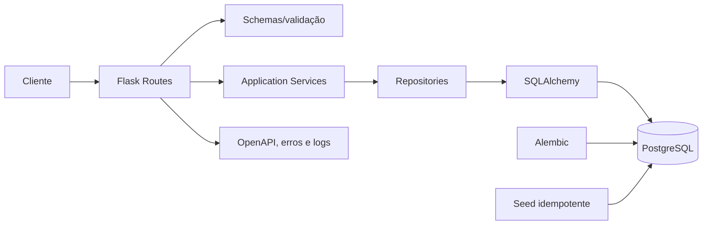
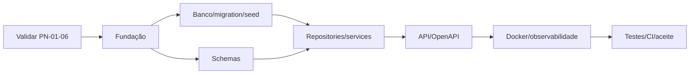

# Refinamento técnico - API de dados de obesidade

## 1. Objetivo e escopo

Criar uma API REST em Python/Flask para disponibilizar domínios, validar os 13 campos obrigatórios e persistir respostas no PostgreSQL. A solução deve executar com Docker Compose e possuir migrations, OpenAPI, health checks, logs e testes automatizados.

Incluído no MVP:

- consulta de todos os domínios e de um domínio específico;
- cadastro e consulta por identificador de uma resposta;
- validação de tipo, obrigatoriedade, faixa e domínio;
- PostgreSQL com migration e seed idempotente;
- Dockerfile, Compose, documentação e testes.

Fora do MVP: frontend, machine learning, cálculo de `obesity`, edição/exclusão, relatórios, administração de domínios, deploy em nuvem e autenticação ainda não especificada.

## 2. Decisões e pendências

1. Todos os campos são obrigatórios; `null` e campos extras são rejeitados.
2. A v1 preserva `come_vegetaiis`, `frequencia_semanal_atvidade_fisica`, `alimentos_calorico` e o literal `somentimes`. Correções exigem versionamento.
3. `obesity` é recebido e persistido, não calculado.
4. IDs são UUID e datas usam UTC/`TIMESTAMPTZ`.
5. Alembic cria o schema; não usar `db.create_all()` em runtime.
6. Seed usa upsert e pode ser reexecutado sem duplicar.
7. A aplicação valida para fornecer mensagens claras; o banco repete regras essenciais com `NOT NULL` e `CHECK`.

| ID | Pendência de DoR | Proposta |
|---|---|---|
| PN-01 | Faixa de idade | 1-120 anos |
| PN-02 | Rótulos de água | 1 até 1 L; 2 entre 1-2 L; 3 mais de 2 L/dia |
| PN-03 | `somentimes` ou `sometimes` | Manter o primeiro na v1 |
| PN-04 | Nomes com erro ortográfico | Manter na v1 |
| PN-05 | `obesity` entrada ou resultado | Entrada no MVP |
| PN-06 | Ausência de autenticação | Somente local/acadêmico até decisão de segurança |

## 3. Contrato de dados

| Campo | Tipo | Valores/regra |
|---|---|---|
| `idade` | integer | Proposta: 1-120 |
| `sexo_biologico` | integer | 1, 2 |
| `come_vegetaiis` | integer | 1, 2, 3 |
| `refeicoes_diariamente` | integer | 1, 2, 3, 4, 5 |
| `come_entre_refeicao` | string | no, somentimes, frequently, always |
| `litro_agua` | integer | 1, 2, 3 |
| `frequencia_semanal_atvidade_fisica` | integer | 0, 1, 2, 3, 4 |
| `horas_dispositivo_eletronico` | integer | 0, 1, 2 |
| `consome_bebida_alcoolica` | string | no, somentimes, frequently, always |
| `historico_familiar` | string | yes, no |
| `alimentos_calorico` | string | yes, no |
| `meio_transporte` | string | automobile, motorbike, bike, public_transportation, walking |
| `obesity` | string | Sete classificações abaixo |

Todos são obrigatórios e não aceitam `null`. Inteiros não aceitam strings numéricas.

Domínios/rótulos:

- sexo: 1 Masculino; 2 Feminino;
- vegetais: 1 Raramente; 2 Às vezes; 3 Sempre;
- refeições: 1 Uma; 2 Duas; 3 Três; 4 Quatro; 5 Mais de quatro;
- frequências textuais: no Não; somentimes Às vezes; frequently Frequentemente; always Sempre;
- água: 1 Até 1 L; 2 Entre 1-2 L; 3 Mais de 2 L/dia (confirmar);
- atividade: 0 Nenhuma; 1 1-2x; 2 3-4x; 3 5x; 4 mais de 5x/semana;
- dispositivo: 0 0-2h; 1 3-5h; 2 mais de 5h/dia;
- yes/no: yes Sim; no Não;
- transporte: automobile Carro; motorbike Moto; bike Bicicleta; public_transportation Transporte público; walking A pé;
- obesity: `Insufficient_Weight`, `Normal_Weight`, `Overweight_Level_I`, `Overweight_Level_II`, `Obesity_Type_I`, `Obesity_Type_II`, `Obesity_Type_III`.

## 4. API REST

Prefixo: `/api/v1`; conteúdo: `application/json`.

| Método | Rota | Resultado |
|---|---|---|
| GET | `/health/live` | 200 se processo ativo |
| GET | `/health/ready` | 200 ou 503 conforme banco |
| GET | `/api/v1/domains` | Todos os domínios ativos |
| GET | `/api/v1/domains/{field_name}` | 200 ou 404 |
| POST | `/api/v1/obesity-records` | 201, UUID e `Location` |
| GET | `/api/v1/obesity-records/{id}` | 200 ou 404 |
| GET | `/api/docs` e `/api/openapi.json` | Documentação |

Exemplo de cadastro:

```json
{
  "idade": 35,
  "sexo_biologico": 1,
  "come_vegetaiis": 2,
  "refeicoes_diariamente": 3,
  "come_entre_refeicao": "somentimes",
  "litro_agua": 2,
  "frequencia_semanal_atvidade_fisica": 2,
  "horas_dispositivo_eletronico": 1,
  "consome_bebida_alcoolica": "no",
  "historico_familiar": "yes",
  "alimentos_calorico": "no",
  "meio_transporte": "public_transportation",
  "obesity": "Normal_Weight"
}
```

Erros usam `application/problem+json` com `type`, `title`, `status`, `detail`, `instance`, `request_id` e lista `errors` nas validações.

| Status | Uso |
|---|---|
| 400 | JSON vazio/malformado |
| 404 | Recurso inexistente |
| 413 | Corpo acima do limite |
| 415 | Conteúdo não JSON |
| 422 | Campo, tipo, faixa ou domínio inválido |
| 500 | Erro interno sem detalhes sensíveis |
| 503 | Readiness com dependência indisponível |

## 5. Arquitetura



Responsabilidades:

- routes: HTTP e serialização;
- schemas: tipos, obrigatoriedade, domínios e rejeição de extras;
- services: casos de uso e transações;
- repositories: persistência e consultas;
- models: tabelas, índices e constraints;
- cross-cutting: configuração, erros, request ID, logs e saúde.

Estrutura sugerida:

```text
app/
├── api/{errors,health_routes,domain_routes,obesity_record_routes}.py
├── schemas/{domain_schema,obesity_record_schema}.py
├── services/{domain_service,obesity_record_service}.py
├── repositories/{domain_repository,obesity_record_repository}.py
├── models/{domain,obesity_record}.py
├── config.py
├── extensions.py
└── __init__.py
migrations/  seeds/  tests/{unit,integration,contract,e2e}/
Dockerfile  compose.yaml  pyproject.toml  .env.example  README.md  wsgi.py
```

Stack sugerida: Flask application factory, SQLAlchemy 2, Alembic/Flask-Migrate, psycopg, Marshmallow/Flask-Smorest ou equivalente, Pytest, Ruff, type checker e Gunicorn. Fixar versões no gerenciador de dependências.

## 6. Banco e contêineres

Tabelas:

- `domain_field(id, name unique, label, data_type, required, active, timestamps)`;
- `domain_option(id, domain_field_id FK, value, label, display_order, active, timestamps)`, com `unique(domain_field_id, value)`;
- `obesity_record(id UUID, 13 campos NOT NULL, created_at)`.

Criar `CHECK` de idade e de cada domínio, índice em `obesity_record.created_at` e em `domain_option(domain_field_id, active, display_order)`.

Fluxo: migration cria schema; seed faz upsert; CI aplica tudo em banco vazio e repete seed; um job `migrate` executa antes dos workers web.

Compose:

- `db`: PostgreSQL, volume e health check;
- `migrate`: migration + seed após banco saudável;
- `api`: Gunicorn após conclusão de `migrate`.

Variáveis: `APP_ENV`, `DATABASE_URL`, `LOG_LEVEL`, `SECRET_KEY`. A imagem usa usuário não root, dependências fixadas, `.dockerignore`, encerramento gracioso e banco não exposto fora do perfil local.

## 7. Requisitos não funcionais

- Não logar payload; registrar request ID, método, rota, status e duração.
- Limitar corpo, pool e timeouts; usar ORM parametrizado.
- Não retornar stack trace, conexão ou credenciais.
- Liveness independe do banco; readiness depende.
- Meta inicial: p95 < 500 ms no POST e < 300 ms em domínios sob 20 req/s, em ambiente documentado.
- Cobertura proposta: 80% geral e 100% das regras de domínio exercitadas.
- CI executa lint, tipos, testes, coverage, migration, OpenAPI, build e análise de dependências/imagem.
- Exposição pública exige autenticação, autorização, consentimento e retenção definidos.

## 8. Backlog técnico

| ID | Atividade / critério de aceite | Dependência |
|---|---|---|
| AT-01 | Criar projeto, application factory e configuração por ambiente | - |
| AT-02 | Fixar dependências, lint, format e type checking | AT-01 |
| AT-03 | Criar gitignore, dockerignore e env de exemplo | AT-01 |
| AT-04 | Configurar SQLAlchemy, sessão, pool e rollback | AT-01 |
| AT-05 | Criar models, constraints e índices | AT-04 |
| AT-06 | Criar migration inicial e testar banco vazio | AT-05 |
| AT-07 | Criar seed idempotente dos domínios | AT-06 |
| AT-08 | Criar repositories e testes com PostgreSQL | AT-05 |
| AT-09 | Criar schemas estritos de entrada/saída | AT-02 |
| AT-10 | Implementar faixa e domínios aprovados | AT-09, PN-01-05 |
| AT-11 | Implementar services de domínios, cadastro e consulta | AT-08, AT-10 |
| AT-12 | Implementar GET de domínios | AT-11 |
| AT-13 | Implementar POST/GET de respostas | AT-11 |
| AT-14 | Implementar erros problem+json e request ID | AT-12-13 |
| AT-15 | Implementar liveness/readiness | AT-04 |
| AT-16 | Gerar OpenAPI com schemas, status e exemplos | AT-12-14 |
| AT-17 | Criar Dockerfile não root | AT-02 |
| AT-18 | Criar Compose db/migrate/api e health checks | AT-06-07, AT-17 |
| AT-19 | Implementar logs JSON sem payload | AT-14 |
| AT-20 | Configurar limite de corpo, timeouts e pool | AT-04, AT-13 |
| AT-21 | Criar fixtures/factories isoladas | AT-06-07 |
| AT-22 | Testes unitários de schemas/services | AT-10-11 |
| AT-23 | Testes de repository, migration, seed e rollback | AT-08, AT-21 |
| AT-24 | Testes HTTP e de contrato OpenAPI | AT-12-16 |
| AT-25 | Smoke E2E via Compose | AT-18, AT-24 |
| AT-26 | Teste de desempenho | AT-25 |
| AT-27 | Análise de código, dependências e imagem | AT-02, AT-17 |
| AT-28 | Pipeline CI completo | AT-22-27 |
| AT-29 | README: setup, migration, testes, curl e troubleshooting | AT-18 |
| AT-30 | Registrar decisões PN-01-06 e evidências | Todas |

## 9. Cenários de teste

### 9.1 Convenções de execução

Cada cenário altera somente o campo em teste de um payload-base válido. Os testes de valores aceitos devem ser parametrizados: cada valor listado gera uma execução independente do `POST /api/v1/obesity-records`, deve retornar `201` e deve ser conferido n

Para entradas inválidas, a API deve retornar `422 application/problem+json`, não persistir registro e incluir em `errors` o nome exato do campo e um dos códigos:

- `required`: campo omitido;
- `null_not_allowed`: valor `null`;
- `invalid_type`: tipo JSON incorreto;
- `invalid_domain`: valor não pertencente ao domínio;
- `out_of_range`: inteiro fora da faixa permitida.

A faixa de `idade` fica definida nesta revisão como 1 a 120 anos, inclusive. Qualquer valor maior que 120 deve ser rejeitado.

### 9.2 Idade

| ID | Entrada testada | Resultado esperado |
|---|---|---|
| CT-IDADE-01 | `1`, `18`, `35` e `120`, individualmente | `201`; idade persistida sem alteração |
| CT-IDADE-02 | `0` e `-1` | `422`, campo `idade`, código `out_of_range` |
| CT-IDADE-03 | `121`, `150` e `2147483647` | `422`, campo `idade`, código `out_of_range`; nada persistido |
| CT-IDADE-04 | `35.5`, `"35"`, `true`, objeto e lista | `422`, campo `idade`, código `invalid_type` |
| CT-IDADE-05 | `null` | `422`, campo `idade`, código `null_not_allowed` |
| CT-IDADE-06 | Campo omitido | `422`, campo `idade`, código `required` |

### 9.3 Sexo biológico

| ID | Entrada testada | Resultado esperado |
|---|---|---|
| CT-SEXO-01 | `1` e `2`, individualmente | Ambos retornam `201` e são persistidos |
| CT-SEXO-02 | `-1`, `0`, `3` e `99` | `422`, `sexo_biologico`, `invalid_domain` |
| CT-SEXO-03 | `"1"`, `1.0`, `true`, objeto e lista | `422`, `sexo_biologico`, `invalid_type` |
| CT-SEXO-04 | `null` e campo omitido | `422`, `null_not_allowed` ou `required` |

### 9.4 Consumo de vegetais - campo `come_vegetaiis`

O nome contém erro ortográfico no contrato funcional e será preservado na API v1.

| ID | Entrada testada | Resultado esperado |
|---|---|---|
| CT-VEGETAIS-01 | `1`, `2` e `3`, individualmente | Todos retornam `201` e são persistidos |
| CT-VEGETAIS-02 | `-1`, `0`, `4` e `99` | `422`, `come_vegetaiis`, `invalid_domain` |
| CT-VEGETAIS-03 | `"1"`, `1.5`, `true`, objeto e lista | `422`, `come_vegetaiis`, `invalid_type` |
| CT-VEGETAIS-04 | `null` e campo omitido | `422`, `null_not_allowed` ou `required` |

### 9.5 Refeições diárias

| ID | Entrada testada | Resultado esperado |
|---|---|---|
| CT-REFEICOES-01 | `1`, `2`, `3`, `4` e `5`, individualmente | Todos retornam `201` |
| CT-REFEICOES-02 | `-1`, `0`, `6` e `99` | `422`, `refeicoes_diariamente`, `invalid_domain` |
| CT-REFEICOES-03 | `"3"`, `3.5`, `true`, objeto e lista | `422`, `refeicoes_diariamente`, `invalid_type` |
| CT-REFEICOES-04 | `null` e campo omitido | `422`, `null_not_allowed` ou `required` |

### 9.6 Consumo entre refeições

| ID | Entrada testada | Resultado esperado |
|---|---|---|
| CT-ENTRE-01 | `"no"`, `"somentimes"`, `"frequently"`, `"always"` | Cada literal retorna `201` |
| CT-ENTRE-02 | `"sometimes"`, `"never"`, `"NO"`, `""` e `" "` | `422`, `come_entre_refeicao`, `invalid_domain` |
| CT-ENTRE-03 | `1`, `true`, objeto e lista | `422`, `come_entre_refeicao`, `invalid_type` |
| CT-ENTRE-04 | `null` e campo omitido | `422`, `null_not_allowed` ou `required` |

### 9.7 Consumo de água

| ID | Entrada testada | Resultado esperado |
|---|---|---|
| CT-AGUA-01 | `1`, `2` e `3`, individualmente | Todos retornam `201` |
| CT-AGUA-02 | `-1`, `0`, `4` e `99` | `422`, `litro_agua`, `invalid_domain` |
| CT-AGUA-03 | `"2"`, `2.5`, `true`, objeto e lista | `422`, `litro_agua`, `invalid_type` |
| CT-AGUA-04 | `null` e campo omitido | `422`, `null_not_allowed` ou `required` |

### 9.8 Frequência semanal de atividade física

| ID | Entrada testada | Resultado esperado |
|---|---|---|
| CT-ATIVIDADE-01 | `0`, `1`, `2`, `3` e `4`, individualmente | Todos retornam `201` |
| CT-ATIVIDADE-02 | `-1`, `5` e `99` | `422`, `frequencia_semanal_atvidade_fisica`, `invalid_domain` |
| CT-ATIVIDADE-03 | `"0"`, `2.5`, `true`, objeto e lista | `422`, campo correto, `invalid_type` |
| CT-ATIVIDADE-04 | `null` e campo omitido | `422`, `null_not_allowed` ou `required` |

### 9.9 Horas em dispositivo eletrônico

| ID | Entrada testada | Resultado esperado |
|---|---|---|
| CT-DISPOSITIVO-01 | `0`, `1` e `2`, individualmente | Todos retornam `201` |
| CT-DISPOSITIVO-02 | `-1`, `3` e `99` | `422`, `horas_dispositivo_eletronico`, `invalid_domain` |
| CT-DISPOSITIVO-03 | `"1"`, `1.5`, `true`, objeto e lista | `422`, campo correto, `invalid_type` |
| CT-DISPOSITIVO-04 | `null` e campo omitido | `422`, `null_not_allowed` ou `required` |

### 9.10 Consumo de bebida alcoólica

| ID | Entrada testada | Resultado esperado |
|---|---|---|
| CT-ALCOOL-01 | `"no"`, `"somentimes"`, `"frequently"`, `"always"` | Cada literal retorna `201` |
| CT-ALCOOL-02 | `"sometimes"`, `"never"`, `"NO"`, `""` e `" "` | `422`, `consome_bebida_alcoolica`, `invalid_domain` |
| CT-ALCOOL-03 | `1`, `true`, objeto e lista | `422`, campo correto, `invalid_type` |
| CT-ALCOOL-04 | `null` e campo omitido | `422`, `null_not_allowed` ou `required` |

### 9.11 Histórico familiar

| ID | Entrada testada | Resultado esperado |
|---|---|---|
| CT-HISTORICO-01 | `"yes"` e `"no"`, individualmente | Ambos retornam `201` |
| CT-HISTORICO-02 | `"sim"`, `"nao"`, `"Yes"`, `""` e `" "` | `422`, `historico_familiar`, `invalid_domain` |
| CT-HISTORICO-03 | `1`, `true`, objeto e lista | `422`, campo correto, `invalid_type` |
| CT-HISTORICO-04 | `null` e campo omitido | `422`, `null_not_allowed` ou `required` |

### 9.12 Consumo de alimentos calóricos

| ID | Entrada testada | Resultado esperado |
|---|---|---|
| CT-CALORICO-01 | `"yes"` e `"no"`, individualmente | Ambos retornam `201` |
| CT-CALORICO-02 | `"sim"`, `"nao"`, `"Yes"`, `""` e `" "` | `422`, `alimentos_calorico`, `invalid_domain` |
| CT-CALORICO-03 | `1`, `true`, objeto e lista | `422`, campo correto, `invalid_type` |
| CT-CALORICO-04 | `null` e campo omitido | `422`, `null_not_allowed` ou `required` |

### 9.13 Meio de transporte

| ID | Entrada testada | Resultado esperado |
|---|---|---|
| CT-TRANSPORTE-01 | `"automobile"`, `"motorbike"`, `"bike"`, `"public_transportation"`, `"walking"` | Cada literal retorna `201` |
| CT-TRANSPORTE-02 | `"car"`, `"bus"`, `"motorcycle"`, `"AUTOMOBILE"`, `""` | `422`, `meio_transporte`, `invalid_domain` |
| CT-TRANSPORTE-03 | `1`, `true`, objeto e lista | `422`, campo correto, `invalid_type` |
| CT-TRANSPORTE-04 | `null` e campo omitido | `422`, `null_not_allowed` ou `required` |

### 9.14 Classificação de obesidade

| ID | Entrada testada | Resultado esperado |
|---|---|---|
| CT-OBESITY-01 | `"Insufficient_Weight"`, `"Normal_Weight"`, `"Overweight_Level_I"`, `"Overweight_Level_II"`, `"Obesity_Type_I"`, `"Obesity_Type_II"`, `"Obesity_Type_III"` | Cada classificação retorna `201` e é persistida |
| CT-OBESITY-02 | `"Obesity_Type_IV"`, `"normal_weight"`, `"Obesity"`, `""` e `" "` | `422`, `obesity`, `invalid_domain` |
| CT-OBESITY-03 | `1`, `true`, objeto e lista | `422`, `obesity`, `invalid_type` |
| CT-OBESITY-04 | `null` e campo omitido | `422`, `null_not_allowed` ou `required` |

### 9.15 Consistência do endpoint de domínios

| ID | Cenário | Resultado esperado |
|---|---|---|
| CT-DOMINIOS-01 | Consultar `GET /api/v1/domains` | `200`; exatamente os 12 campos categóricos |
| CT-DOMINIOS-02 | Comparar cada conjunto de opções com as seções 9.3 a 9.14 | Nenhum código ausente, extra ou duplicado |
| CT-DOMINIOS-03 | Conferir tipo de cada `value` | Inteiros permanecem números JSON; códigos textuais permanecem strings |
| CT-DOMINIOS-04 | Consultar cada `field_name` válido | `200`, somente as opções do campo e na ordem definida |
| CT-DOMINIOS-05 | Consultar campo inexistente e `idade` como domínio | `404`, pois idade usa faixa e não catálogo |
| CT-DOMINIOS-06 | Inativar opção no arranjo de teste | Opção não aparece; registros históricos continuam legíveis |
| CT-DOMINIOS-07 | Executar seed duas vezes | Mesma quantidade e conteúdo; nenhuma duplicação |

### 9.16 Cenários transversais, banco e infraestrutura

| ID | Cenário | Resultado esperado |
|---|---|---|
| CT-API-01 | Payload-base integralmente válido | `201`, UUID, `Location`, data UTC e um registro |
| CT-API-02 | Dois payloads idênticos | Dois UUIDs, pois não há regra de unicidade funcional |
| CT-API-03 | Objeto vazio ou campo desconhecido | `422`; lista de obrigatórios ou `unknown_field` |
| CT-API-04 | Corpo vazio/JSON malformado | `400` |
| CT-API-05 | Content-Type não JSON/corpo acima do limite | `415`/`413` |
| CT-DB-01 | Aplicar migration em PostgreSQL vazio | Tabelas, índices e constraints criados |
| CT-DB-02 | Inserir diretamente valor fora do domínio | Banco rejeita por `CHECK` |
| CT-DB-03 | Falha durante cadastro | Rollback; nenhum registro parcial |
| CT-SEC-01 | Texto de SQL injection em campo textual | `422`; nenhuma instrução executada |
| CT-SEC-02 | Erro de validação ou persistência | Logs não contêm o payload |
| CT-HEALTH-01 | Banco saudável/indisponível | Readiness `200`/`503`; liveness permanece `200` |
| CT-OBS-01 | Request ID recebido/ausente | Propagado ou gerado e presente nos logs |
| CT-DOCKER-01 | Build e Compose em ambiente limpo | Migration, seed e API ficam saudáveis |
| CT-DOCKER-02 | Reiniciar API mantendo volume | Dados preservados; seed não duplica |
| CT-CONTRATO-01 | Validar OpenAPI e exemplos | Documento válido e compatível com a API |
| CT-PERF-01 | Executar carga definida nos requisitos não funcionais | Latência e taxa de erros dentro das metas |

### 9.17 Estratégia e rastreabilidade

- Testes unitários: schemas, tipos, limites e serviços sem banco.
- Testes de integração: repositories, constraints, migration, seed e rollback usando PostgreSQL real.
- Testes de contrato: todos os endpoints, status, headers, problem details e OpenAPI.
- Testes E2E: Docker Compose, cadastro, consulta e health checks.
- Não usar SQLite como substituto do PostgreSQL.
- Cada código listado como aceitável deve gerar um caso parametrizado identificável no relatório do Pytest.
- A cobertura somente será considerada suficiente se todos os IDs desta seção estiverem automatizados ou possuírem justificativa formal.

## 10. Definition of Ready - DoR

- [ ] PN-01 a PN-05 aprovadas e PN-06 registrada para o ambiente;
- [ ] campos, tipos, obrigatoriedade, domínios e nomes aprovados;
- [ ] rotas, payloads, respostas e status revisados;
- [ ] critérios de aceite e cenários positivos/negativos definidos;
- [ ] dependências concluídas ou planejadas;
- [ ] repositório e Docker disponíveis;
- [ ] riscos e sensibilidade dos dados identificados;
- [ ] atividade estimada, dividida e sem bloqueio externo conhecido.

## 11. Definition of Done - DoD

- [ ] implementação segue arquitetura e critérios de aceite;
- [ ] revisão de código concluída;
- [ ] lint, format e type checking aprovados;
- [ ] testes unitários, integração, contrato e smoke aprovados;
- [ ] cobertura mínima e matriz completa de domínios atingidas;
- [ ] migration funciona em banco vazio e seed é idempotente;
- [ ] OpenAPI, README e troubleshooting atualizados;
- [ ] Docker build e Compose funcionam em ambiente limpo;
- [ ] nenhum segredo/payload sensível está no código, imagem, erro ou log;
- [ ] análises de dependências e imagem aprovadas;
- [ ] evidências e decisões funcionais anexadas;
- [ ] aceite cadastra uma resposta e consulta os domínios;
- [ ] pipeline aprovado na branch definida.

## 12. Critérios de aceite, sequência e riscos

Critérios finais do MVP:

1. ambiente inicia com migration e seed sem duplicação;
2. domínios retornam campos, códigos, rótulos e ordem;
3. payload válido retorna 201, UUID e persiste uma resposta;
4. campo ausente, tipo/domínio inválido ou extra retorna 422 detalhado;
5. UUID existente/inexistente retorna 200/404;
6. banco indisponível produz readiness 503 sem vazar detalhes;
7. README permite executar o smoke test em Docker limpo;
8. pipeline valida qualidade, testes, migration, contrato e imagem.



Riscos principais: ambiguidade em idade/água, erros ortográficos virarem contrato público, `obesity` ser resultado em vez de entrada, divergência entre seed e constraints, dados de saúde em logs, migrations concorrentes e falsa confiança com SQLite.

Mitigações: resolver PN-01-05 antes do desenvolvimento, versionar o contrato, testar consistência catálogo/banco, bloquear payload nos logs, usar job dedicado de migration e testar com PostgreSQL real.

Evidências esperadas: OpenAPI validado, pipeline e cobertura, migration em banco vazio, seed repetido sem duplicação, smoke via Compose, exemplos curl e decisões PN-01-06.
