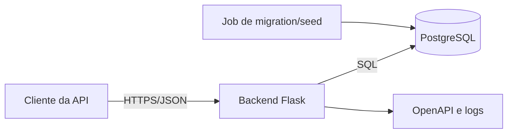
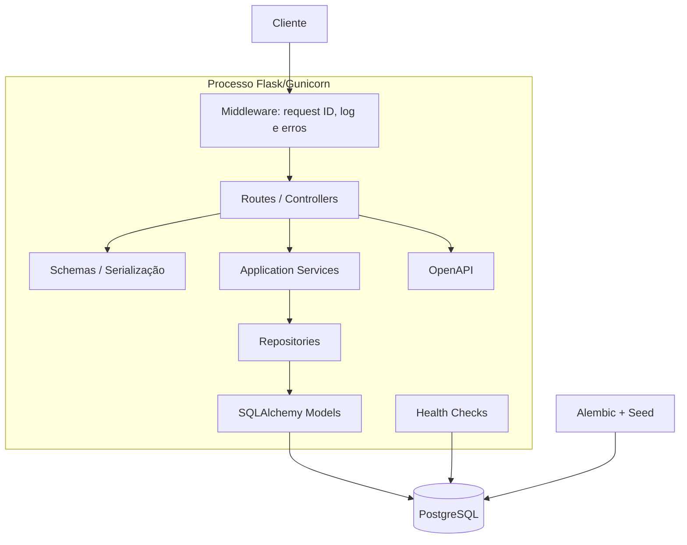
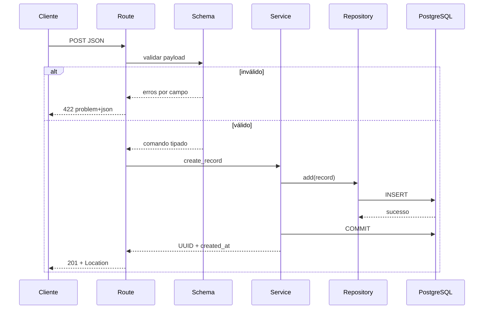
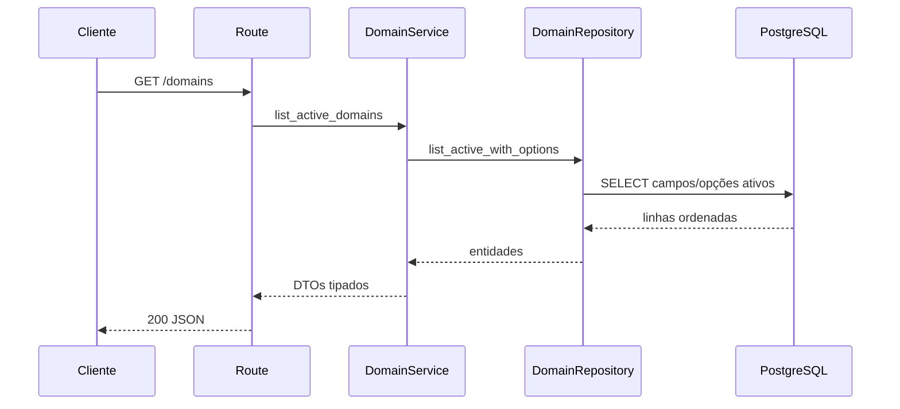
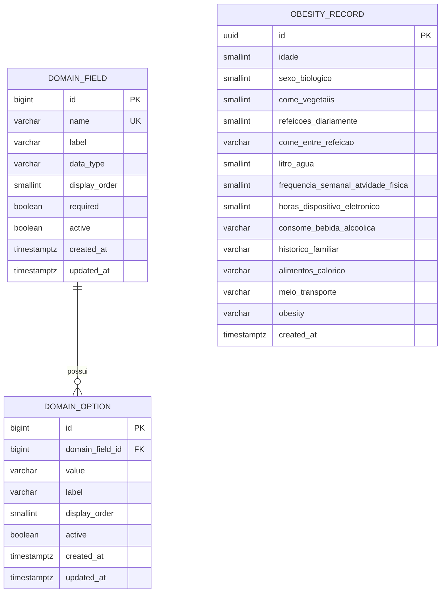
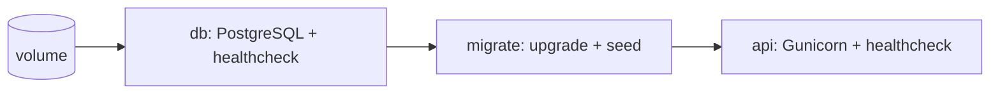

# Specs SDD - API de dados de obesidade

## 1. Identificação

| Item | Definição |
|---|---|
| Documento | Software Design Document (SDD) |
| Sistema | API de cadastro de dados de obesidade |
| Fonte | `refinamento-tecnico.md` |
| Versão da API | v1 |
| Stack | Python, Flask e PostgreSQL |
| Execução | Docker Compose |
| Status | Especificação para implementação |

## 2. Objetivo

Definir o desenho interno necessário para implementar a API descrita no refinamento técnico.

Este documento especifica:

- arquitetura e responsabilidades;
- componentes e interfaces internas;
- contratos HTTP;
- modelo físico e integridade do banco;
- fluxos de execução;
- validações e tratamento de erros;
- observabilidade, segurança e implantação;
- estratégia de testes e rastreabilidade.

## 3. Escopo

### 3.1 Incluído

- consulta de todos os domínios ativos;
- consulta de um domínio por nome;
- cadastro de uma resposta do formulário;
- consulta da resposta por UUID;
- liveness, readiness e OpenAPI;
- PostgreSQL com migration e seed;
- Docker, CI, logs e testes automatizados.

### 3.2 Não incluído

- frontend;
- autenticação e autorização;
- atualização ou exclusão de respostas;
- listagem geral de respostas;
- cálculo ou inferência de `obesity`;
- relatórios e exportações;
- administração de domínios pela API;
- infraestrutura de nuvem.

A ausência de autenticação limita o uso a ambiente local/acadêmico.

## 4. Decisões consolidadas

| ID | Decisão |
|---|---|
| DD-01 | Arquitetura modular em camadas dentro de um único serviço Flask |
| DD-02 | Application factory para criação da aplicação |
| DD-03 | SQLAlchemy 2 para acesso ao PostgreSQL |
| DD-04 | Alembic para evolução versionada do schema |
| DD-05 | UUID gerado pela aplicação com `uuid4` |
| DD-06 | Datas persistidas como `TIMESTAMPTZ` em UTC |
| DD-07 | Validação em aplicação e constraints equivalentes no banco |
| DD-08 | Seed idempotente com upsert pela chave natural |
| DD-09 | Migration executada em job separado dos workers web |
| DD-10 | Erros HTTP no formato `application/problem+json` |
| DD-11 | Campos extras, valores nulos e coerção implícita são rejeitados |
| DD-12 | PostgreSQL real nos testes de integração |
| DD-13 | Payload nunca é incluído nos logs |
| DD-14 | Idade aceita somente entre 1 e 120, inclusive |
| DD-15 | Nomes e literal `somentimes` são preservados na API v1 |
| DD-16 | `obesity` é entrada informada pelo cliente no MVP |

## 5. Visão arquitetural

### 5.1 Contexto



### 5.2 Componentes



### 5.3 Dependências permitidas

```text
routes -> schemas
routes -> services
services -> repositories
repositories -> models / SQLAlchemy session
models -> SQLAlchemy
```

Dependências inversas não são permitidas.

Models não conhecem HTTP. Repositories não montam respostas HTTP.

Services não acessam objetos globais de request.

### 5.4 Justificativa

Um serviço modular é suficiente para o MVP e reduz custo operacional.

A separação em camadas permite testar regras sem servidor HTTP e trocar detalhes de persistência.

## 6. Estrutura do projeto

```text
backend/
├── app/
│   ├── __init__.py
│   ├── config.py
│   ├── extensions.py
│   ├── api/
│   │   ├── errors.py
│   │   ├── health_routes.py
│   │   ├── domain_routes.py
│   │   └── obesity_record_routes.py
│   ├── schemas/
│   │   ├── domain_schema.py
│   │   └── obesity_record_schema.py
│   ├── services/
│   │   ├── domain_service.py
│   │   └── obesity_record_service.py
│   ├── repositories/
│   │   ├── domain_repository.py
│   │   └── obesity_record_repository.py
│   └── models/
│       ├── domain.py
│       └── obesity_record.py
├── migrations/
├── seeds/
│   └── domain_options.py
├── tests/
│   ├── unit/
│   ├── integration/
│   ├── contract/
│   └── e2e/
├── alembic.ini
├── Dockerfile
├── compose.yaml
├── pyproject.toml
├── .env.example
├── README.md
└── wsgi.py
```

## 7. Tecnologias

| Componente | Escolha |
|---|---|
| Framework HTTP | Flask com application factory |
| ORM | SQLAlchemy 2 |
| Migration | Alembic ou Flask-Migrate |
| Driver | psycopg |
| Schema/OpenAPI | Marshmallow + Flask-Smorest ou equivalente |
| Servidor WSGI | Gunicorn |
| Testes | Pytest |
| Qualidade | Ruff e type checker definido pelo time |
| Banco | PostgreSQL |
| Contêineres | Docker e Docker Compose |

Versões exatas devem ser fixadas no arquivo de dependências.

## 8. Configuração da aplicação

### 8.1 Application factory

A função `create_app(config_name=None)` deve:

1. carregar configuração;
2. inicializar SQLAlchemy e extensões;
3. registrar blueprints;
4. registrar handlers globais de erro;
5. registrar middleware de request ID e logs;
6. disponibilizar OpenAPI;
7. não executar migration ou seed.

### 8.2 Variáveis

| Variável | Obrigatória | Uso |
|---|---|---|
| `APP_ENV` | Sim | Seleção do ambiente |
| `DATABASE_URL` | Sim | Conexão PostgreSQL |
| `LOG_LEVEL` | Não | Nível de log; padrão INFO |
| `SECRET_KEY` | Conforme extensão | Nunca versionar valor real |
| `MAX_CONTENT_LENGTH` | Não | Limite do JSON; proposta 64 KiB |
| `DB_POOL_SIZE` | Não | Tamanho do pool; proposta 5 |
| `DB_MAX_OVERFLOW` | Não | Overflow; proposta 10 |
| `DB_POOL_TIMEOUT` | Não | Espera por conexão; proposta 10 s |
| `READINESS_TIMEOUT` | Não | Timeout do banco; proposta 2 s |

A aplicação deve falhar na inicialização quando configuração obrigatória estiver ausente.

## 9. Componentes e interfaces internas

### 9.1 Schemas

`ObesityRecordCreateSchema`:

- exige exatamente os 13 campos;
- rejeita campos desconhecidos;
- não aceita null;
- usa inteiros estritos;
- valida idade entre 1 e 120;
- valida os domínios textuais e numéricos.

`ObesityRecordCreatedSchema` contém `id` e `created_at`.

`ObesityRecordReadSchema` contém metadados e os 13 campos.

`DomainFieldSchema` contém:

- `field`;
- `label`;
- `type`;
- `required`;
- `options`.

Cada opção contém `value`, `label` e `order`.

### 9.2 Services

Interface lógica de `DomainService`:

```python
list_active_domains() -> list[DomainFieldDTO]
get_active_domain(field_name: str) -> DomainFieldDTO
```

Interface lógica de `ObesityRecordService`:

```python
create_record(command: CreateObesityRecord) -> CreatedRecordDTO
get_record(record_id: UUID) -> ObesityRecordDTO
```

O service de cadastro abre a unidade transacional, persiste e confirma o commit.

Qualquer exceção antes do commit produz rollback.

### 9.3 Repositories

`DomainRepository`:

```python
list_active_with_options() -> Sequence[DomainField]
get_active_by_name(name: str) -> DomainField | None
```

`ObesityRecordRepository`:

```python
add(record: ObesityRecord) -> None
get_by_id(record_id: UUID) -> ObesityRecord | None
```

Repositories recebem sessão por injeção e não efetuam commit autônomo.

### 9.4 Serialização dos domínios

`domain_option.value` é armazenado como texto canônico.

`domain_field.data_type` informa `integer` ou `string`.

O serializer converte valores `integer` para número JSON.

Valores `string` permanecem strings.

Essa regra é testada para impedir que `1` seja retornado como `"1"`.

## 10. Contrato HTTP

### 10.1 Regras gerais

- prefixo funcional: `/api/v1`;
- request e response: UTF-8;
- cadastro aceita somente `application/json`;
- códigos textuais diferenciam maiúsculas de minúsculas;
- datas são retornadas em ISO 8601 com `Z`;
- IDs são UUID;
- toda resposta inclui `X-Request-ID`.

### 10.2 Endpoints

| Método | Rota | Caso de uso |
|---|---|---|
| GET | `/health/live` | Verificar processo |
| GET | `/health/ready` | Verificar banco |
| GET | `/api/v1/domains` | Listar domínios |
| GET | `/api/v1/domains/{field_name}` | Consultar domínio |
| POST | `/api/v1/obesity-records` | Criar resposta |
| GET | `/api/v1/obesity-records/{id}` | Consultar resposta |
| GET | `/api/docs` | Interface da documentação |
| GET | `/api/openapi.json` | Documento OpenAPI |

Não existe endpoint de listagem, atualização ou exclusão de respostas no MVP.

### 10.3 POST de resposta

Payload:

```json
{
  "idade": 35,
  "sexo_biologico": 1,
  "come_vegetaiis": 2,
  "refeicoes_diariamente": 3,
  "come_entre_refeicao": "somentimes",
  "litro_agua": 2,
  "frequencia_semanal_atvidade_fisica": 2,
  "horas_dispositivo_eletronico": 1,
  "consome_bebida_alcoolica": "no",
  "historico_familiar": "yes",
  "alimentos_calorico": "no",
  "meio_transporte": "public_transportation",
  "obesity": "Normal_Weight"
}
```

Resposta:

```http
HTTP/1.1 201 Created
Location: /api/v1/obesity-records/{uuid}
Content-Type: application/json
X-Request-ID: {request-id}
```

```json
{
  "id": "0c5d8a70-2654-4ec0-a693-40d616270eb3",
  "created_at": "2026-07-03T01:30:00Z"
}
```

Cadastros iguais são permitidos e recebem UUIDs diferentes.

### 10.4 Consulta de domínios

Resposta resumida:

```json
{
  "data": [
    {
      "field": "sexo_biologico",
      "label": "Sexo biológico",
      "type": "integer",
      "required": true,
      "options": [
        {"value": 1, "label": "Masculino", "order": 1},
        {"value": 2, "label": "Feminino", "order": 2}
      ]
    }
  ]
}
```

O endpoint retorna exatamente 12 campos categóricos.

`idade` não aparece porque usa faixa e não catálogo.

Campos e opções são retornados por `display_order`.

### 10.5 Consulta de resposta

`GET /api/v1/obesity-records/{id}` retorna os 13 campos, `id` e `created_at`.

UUID inexistente retorna 404.

UUID com formato inválido retorna 400 ou 422 conforme convenção do framework.

A escolha deve ser documentada no OpenAPI e mantida consistente.

## 11. Validação

### 11.1 Matriz

| Campo | Tipo | Valores aceitos |
|---|---|---|
| idade | integer | 1 a 120 |
| sexo_biologico | integer | 1, 2 |
| come_vegetaiis | integer | 1, 2, 3 |
| refeicoes_diariamente | integer | 1, 2, 3, 4, 5 |
| come_entre_refeicao | string | no, somentimes, frequently, always |
| litro_agua | integer | 1, 2, 3 |
| frequencia_semanal_atvidade_fisica | integer | 0, 1, 2, 3, 4 |
| horas_dispositivo_eletronico | integer | 0, 1, 2 |
| consome_bebida_alcoolica | string | no, somentimes, frequently, always |
| historico_familiar | string | yes, no |
| alimentos_calorico | string | yes, no |
| meio_transporte | string | automobile, motorbike, bike, public_transportation, walking |
| obesity | string | Sete classificações documentadas |

### 11.2 Códigos de validação

| Código | Uso |
|---|---|
| `required` | Campo omitido |
| `null_not_allowed` | Valor null |
| `invalid_type` | Tipo JSON incorreto |
| `invalid_domain` | Valor fora do domínio |
| `out_of_range` | Idade fora de 1 a 120 |
| `unknown_field` | Campo não reconhecido |

### 11.3 Ordem

1. validar Content-Type e JSON;
2. validar estrutura e campos extras;
3. validar obrigatoriedade e null;
4. validar tipos estritos;
5. validar faixa e domínio;
6. executar service;
7. persistir em transação.

## 12. Erros

### 12.1 Formato

```json
{
  "type": "https://api.local/problems/validation-error",
  "title": "Payload inválido",
  "status": 422,
  "detail": "Um ou mais campos são inválidos.",
  "instance": "/api/v1/obesity-records",
  "request_id": "f75b387d-a9c0-4c24-bef2-39d7f841d278",
  "errors": [
    {
      "field": "idade",
      "code": "out_of_range",
      "message": "O valor deve estar entre 1 e 120."
    }
  ]
}
```

### 12.2 Mapeamento

| Condição | Status |
|---|---|
| JSON vazio ou malformado | 400 |
| Recurso inexistente | 404 |
| Corpo acima do limite | 413 |
| Content-Type não JSON | 415 |
| Campo, tipo, faixa ou domínio inválido | 422 |
| Falha interna não prevista | 500 |
| Banco indisponível no readiness | 503 |

O handler de 500 não retorna detalhes da exceção.

## 13. Fluxos de sequência

### 13.1 Cadastro



### 13.2 Consulta de domínios



## 14. Modelo de dados

### 14.1 Diagrama



### 14.2 Constraints

| Nome sugerido | Regra |
|---|---|
| `uq_domain_field_name` | Nome do campo único |
| `uq_domain_option_field_value` | Opção única por campo |
| `ck_record_idade` | idade entre 1 e 120 |
| `ck_record_sexo` | sexo em 1, 2 |
| `ck_record_vegetais` | vegetais em 1, 2, 3 |
| `ck_record_refeicoes` | refeições em 1 a 5 |
| `ck_record_entre_refeicao` | domínio textual definido |
| `ck_record_agua` | água em 1, 2, 3 |
| `ck_record_atividade` | atividade em 0 a 4 |
| `ck_record_dispositivo` | dispositivo em 0 a 2 |
| `ck_record_alcool` | domínio textual definido |
| `ck_record_historico` | yes ou no |
| `ck_record_calorico` | yes ou no |
| `ck_record_transporte` | cinco transportes permitidos |
| `ck_record_obesity` | sete classificações permitidas |

Todos os 13 campos possuem `NOT NULL`.

### 14.3 Índices

- índice único de `domain_field.name`;
- índice único de campo/opção;
- índice de opções por campo, ativo e ordem;
- índice de respostas por `created_at`.

Não criar índices adicionais sem evidência de consulta.

## 15. Migration e seed

### 15.1 Migration inicial

A migration deve:

1. criar as três tabelas;
2. criar foreign keys, uniques e checks nomeados;
3. criar índices;
4. permitir downgrade no ambiente de teste.

O pipeline aplica upgrade a partir de um PostgreSQL vazio.

### 15.2 Seed

A chave natural de campo é `domain_field.name`.

A chave natural de opção é `(domain_field_id, value)`.

O seed deve:

- inserir ou atualizar rótulo, tipo, ordem e estado ativo;
- não duplicar registros;
- manter códigos já utilizados;
- ser executável mais de uma vez;
- ser testado contra o catálogo do OpenAPI e schemas.

Mudança de código exige migration de dados e decisão de versionamento.

### 15.3 Consistência

Um teste automatizado deve comparar:

1. valores aceitos pelo schema;
2. opções ativas do seed;
3. checks da migration;
4. opções devolvidas pelo endpoint.

Divergência bloqueia o pipeline.

## 16. Transações e conexões

### 16.1 Unidade transacional

Cada request de escrita usa uma sessão.

O service controla commit e rollback.

Repositories não encerram transações.

A sessão é sempre fechada ao final da requisição.

### 16.2 Pool

Valores iniciais propostos:

| Parâmetro | Valor |
|---|---|
| pool_size | 5 |
| max_overflow | 10 |
| pool_timeout | 10 s |
| pool_recycle | 1800 s |
| pool_pre_ping | true |

Os valores são configuráveis por ambiente.

### 16.3 Falhas

| Falha | Comportamento |
|---|---|
| Constraint violada | rollback e erro controlado |
| Banco indisponível | rollback e 500/503 conforme endpoint |
| Pool esgotado | timeout e log sem credenciais |
| Registro inexistente | 404 |
| Migration pendente | readiness deve falhar ou deployment deve bloquear |

## 17. Observabilidade

### 17.1 Request ID

- aceitar `X-Request-ID` somente após validação de tamanho e caracteres;
- gerar UUID quando ausente ou inválido;
- incluir o valor na resposta e nos logs;
- propagar durante toda a requisição.

### 17.2 Logs

Formato JSON com:

- timestamp UTC;
- level;
- request_id;
- método;
- rota normalizada;
- status;
- duração;
- nome do evento;
- classe da exceção quando aplicável.

Proibido registrar:

- payload;
- campos individuais do formulário;
- connection string;
- senha ou segredo;
- SQL com valores;
- stack trace em resposta.

### 17.3 Métricas mínimas

Quando houver coletor disponível:

- total de requests por rota/status;
- duração por rota;
- conexões/erros de banco;
- readiness;
- quantidade de respostas 4xx e 5xx.

## 18. Saúde

### 18.1 Liveness

`GET /health/live` verifica somente o processo.

Não executa SQL.

Retorna 200 enquanto o processo puder atender HTTP.

### 18.2 Readiness

`GET /health/ready` executa uma consulta simples com timeout.

Retorna 200 quando aplicação e banco estão disponíveis.

Retorna 503 sem expor host, porta, usuário ou mensagem do driver.

## 19. Segurança e privacidade

### 19.1 Controles

- validar todo input antes do service;
- usar ORM e parâmetros;
- limitar o corpo a 64 KiB por padrão;
- executar contêiner como usuário não root;
- manter PostgreSQL em rede interna;
- não incluir secrets na imagem ou Git;
- analisar código, dependências e imagem;
- rejeitar campos extras;
- não usar mensagens de banco na resposta;
- limitar CORS ao ambiente necessário.

### 19.2 Dados

Os dados possuem natureza relacionada à saúde e comportamento.

Mesmo sem identificação direta, devem receber tratamento restritivo.

Antes de exposição pública, definir:

- autenticação e autorização;
- finalidade e consentimento;
- retenção e descarte;
- auditoria;
- criptografia em trânsito;
- política de acesso e backup.

### 19.3 Ameaças principais

| Ameaça | Mitigação |
|---|---|
| SQL injection | ORM parametrizado e domínio fechado |
| Mass assignment | Schema rejeita campos extras |
| Payload excessivo | Limite de tamanho |
| Vazamento em logs | Redação e proibição do payload |
| Segredo em imagem | Variáveis e scanner |
| Banco exposto | Rede interna |
| Enumeração de dados | Sem listagem no MVP; autenticação antes do público |
| Dependência vulnerável | Lock e análise contínua |

## 20. Docker e implantação

### 20.1 Imagem

- base Python oficialmente mantida;
- build reproduzível;
- dependências fixadas;
- usuário não root;
- somente arquivos necessários;
- Gunicorn como processo;
- sinais e encerramento gracioso;
- nenhum segredo em layer.

### 20.2 Compose



`api` somente inicia após conclusão bem-sucedida de `migrate`.

O banco não publica porta por padrão.

Um perfil local pode publicar a porta para diagnóstico.

### 20.3 Pipeline

Ordem mínima:

1. instalar dependências;
2. lint e formatação;
3. type checking;
4. testes unitários;
5. subir PostgreSQL;
6. migration e seed;
7. testes de integração e contrato;
8. validar OpenAPI;
9. coverage;
10. build da imagem;
11. análise de dependências e imagem;
12. smoke test.

## 21. Estratégia de testes

### 21.1 Níveis

| Nível | Escopo | Banco |
|---|---|---|
| Unitário | Schemas e services | Não |
| Integração | Models, repositories, migration e seed | PostgreSQL |
| Contrato | Rotas, headers, erros e OpenAPI | PostgreSQL |
| E2E | Compose completo | PostgreSQL |
| Desempenho | Latência e taxa de erro | Ambiente dedicado |

### 21.2 Regras

- cada valor aceito gera uma instância parametrizada;
- cada campo testa valor inválido, tipo incorreto, null e omissão;
- entradas inválidas não persistem;
- testes exibem o ID CT no relatório;
- fixtures isolam transações;
- não usar SQLite para integração;
- cobertura geral mínima de 80%;
- cobertura das regras de domínio de 100%.

### 21.3 Rastreabilidade

| Área | Cenários do refinamento |
|---|---|
| Idade | CT-IDADE-01 a CT-IDADE-06 |
| Sexo | CT-SEXO-01 a CT-SEXO-04 |
| Vegetais | CT-VEGETAIS-01 a CT-VEGETAIS-04 |
| Refeições | CT-REFEICOES-01 a CT-REFEICOES-04 |
| Entre refeições | CT-ENTRE-01 a CT-ENTRE-04 |
| Água | CT-AGUA-01 a CT-AGUA-04 |
| Atividade | CT-ATIVIDADE-01 a CT-ATIVIDADE-04 |
| Dispositivo | CT-DISPOSITIVO-01 a CT-DISPOSITIVO-04 |
| Álcool | CT-ALCOOL-01 a CT-ALCOOL-04 |
| Histórico | CT-HISTORICO-01 a CT-HISTORICO-04 |
| Calórico | CT-CALORICO-01 a CT-CALORICO-04 |
| Transporte | CT-TRANSPORTE-01 a CT-TRANSPORTE-04 |
| Obesidade | CT-OBESITY-01 a CT-OBESITY-04 |
| Domínios | CT-DOMINIOS-01 a CT-DOMINIOS-07 |
| API e banco | CT-API, CT-DB, CT-SEC, CT-HEALTH e CT-OBS |
| Infraestrutura | CT-DOCKER, CT-CONTRATO e CT-PERF |

## 22. Requisitos não funcionais

### 22.1 Desempenho

Meta inicial, em ambiente documentado:

- POST com p95 menor que 500 ms;
- domínios com p95 menor que 300 ms;
- carga de 20 requests por segundo;
- taxa de erro não funcional próxima de zero.

### 22.2 Disponibilidade

- falha do banco não derruba liveness;
- readiness impede roteamento quando banco falha;
- cadastro é atômico;
- reinício da API preserva dados no volume.

### 22.3 Manutenibilidade

- camadas com responsabilidades únicas;
- dependências fixadas;
- migrations versionadas;
- tipos nas interfaces públicas;
- decisões registradas;
- OpenAPI gerado a partir dos schemas ou validado contra eles.

## 23. Mapeamento de implementação

| Fase | Atividades | Resultado |
|---|---|---|
| Fundação | AT-01 a AT-04 | Projeto e conexão |
| Dados | AT-05 a AT-08 | Schema, seed e repositories |
| Validação | AT-09 a AT-11 | Schemas e services |
| API | AT-12 a AT-16 | Rotas, erros, saúde e OpenAPI |
| Operação | AT-17 a AT-20 | Docker, logs e limites |
| Qualidade | AT-21 a AT-28 | Testes, performance e CI |
| Entrega | AT-29 e AT-30 | Documentação e evidências |

## 24. Critérios de aceite do design

O desenho está implementado quando:

1. todas as rotas correspondem ao OpenAPI;
2. todos os domínios são consistentes entre schema, seed, banco e endpoint;
3. idade acima de 120 é rejeitada na aplicação e no banco;
4. migration funciona em banco vazio;
5. seed pode ser repetido;
6. cadastro é transacional;
7. erros seguem problem details;
8. logs não contêm payload;
9. Compose sobe em ambiente limpo;
10. testes e pipeline atendem ao refinamento.

## 25. Riscos e pontos de atenção

| Risco | Tratamento |
|---|---|
| Erros ortográficos virarem contrato | Manter na v1 e corrigir somente com versionamento |
| Literal `somentimes` | Preservar na v1 e documentar no OpenAPI |
| Rótulos de água incorretos | Confirmar antes do seed definitivo |
| Catálogo divergir do banco | Teste automático de consistência |
| Migration concorrente | Job único |
| Payload em logs | Middleware e teste adversarial |
| SQLite mascarar incompatibilidades | PostgreSQL obrigatório |
| API exposta sem identidade | Restringir ao ambiente local/acadêmico |

## 26. Pendências antes da produção pública

- confirmar definitivamente os rótulos de `litro_agua`;
- decidir autenticação e autorização;
- definir retenção, consentimento e descarte;
- definir política de backup e restauração;
- definir CORS, TLS e limites do ambiente;
- aprovar SLOs e estratégia de monitoramento;
- revisar a necessidade de retornar respostas por UUID sem autenticação.

## 27. Definition of Done do SDD

- [ ] design revisado por Backend, Dados, QA e Segurança;
- [ ] decisões refletidas no OpenAPI;
- [ ] migrations correspondem ao modelo físico;
- [ ] cenários CT possuem testes rastreáveis;
- [ ] configuração e execução estão documentadas;
- [ ] riscos e pendências possuem responsáveis;
- [ ] divergências com o refinamento foram resolvidas ou registradas.

